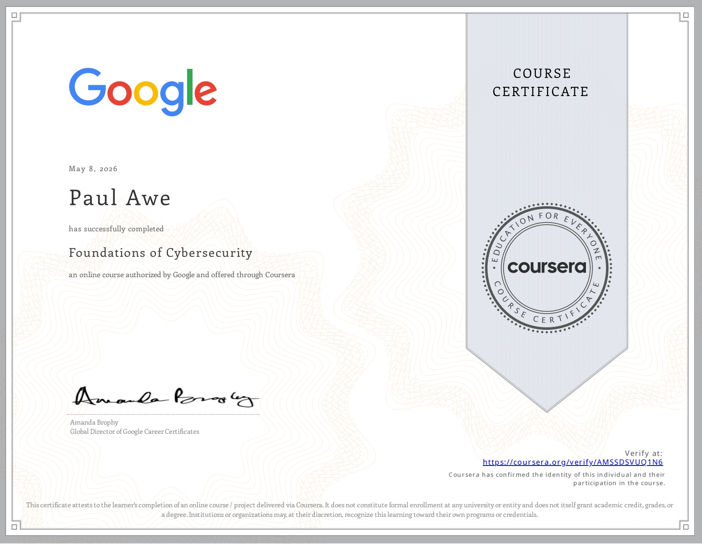

# Google Cybersecurity Certificate — Course 1: Foundations of Cybersecurity

> Part of my cybersecurity learning journey (Google Cybersecurity Certificate)

---

## 🧠 What I learned

### 🔐 Cybersecurity Basics

- Cybersecurity is the practice of protecting systems, networks, and data  
- Focuses on **Confidentiality, Integrity, and Availability (CIA Triad)**  

---

### ⚠️ Common Threats

- **Social Engineering** → exploiting human error  
- **Phishing** → tricking users into revealing sensitive data  
- **Malware** → software designed to harm systems  

---

### 👨‍💻 Types of Hackers

- **Ethical (Authorized)** → follow laws and protect systems  
- **Semi-authorized** → find vulnerabilities but don’t exploit them  
- **Malicious (Unauthorized)** → exploit systems for gain  

---

### 🧩 CISSP Security Domains

1. Security & Risk Management  
2. Asset Security  
3. Security Architecture & Engineering  
4. Communication & Network Security  
5. Identity & Access Management  
6. Security Assessment & Testing  
7. Security Operations  
8. Software Development Security  

---

### 🏗️ Security Frameworks & Controls

- Frameworks help manage risk and protect data  
- Example: **NIST Cybersecurity Framework** :contentReference[oaicite:0]{index=0}  

#### Core Components:
- Identify security goals  
- Set guidelines  
- Implement processes  
- Monitor results  

---

### 🔺 CIA Triad

- **Confidentiality** → Only authorized access  
- **Integrity** → Data is accurate and reliable  
- **Availability** → Data is accessible when needed  

---

### 📊 Logs & Monitoring

- Logs record system events  
- Help detect vulnerabilities and breaches :contentReference[oaicite:1]{index=1}  

---

### 🛠️ Security Tools

- **SIEM (e.g., Splunk, Chronicle)** → analyze logs  
- **Packet sniffers (Wireshark, tcpdump)** → analyze traffic  
- **Playbooks** → guide incident response  

---

### 🧪 Programming & Tools

- **Linux** → used for system analysis  
- **SQL** → query databases  
- **Python** → automate tasks  

---

### 🔐 Additional Concepts

- Encryption → protects data  
- IDS → detects threats  
- Penetration testing → finds vulnerabilities  

---

## 📸 Certificate

📄 Verify certificate:  
https://coursera.org/verify/AMSSDSVUQ1N6 :contentReference[oaicite:2]{index=2}  

---

## 📘 Glossary

Attached is a glossary of key terms from the course:

👉 [View Glossary](../assets/google-cybersecurity-course-01-glossary.pdf)

---

## 📌 Notes

This course gave me a strong foundation in:
- Core cybersecurity concepts  
- Threats and vulnerabilities  
- Security frameworks and tools  
