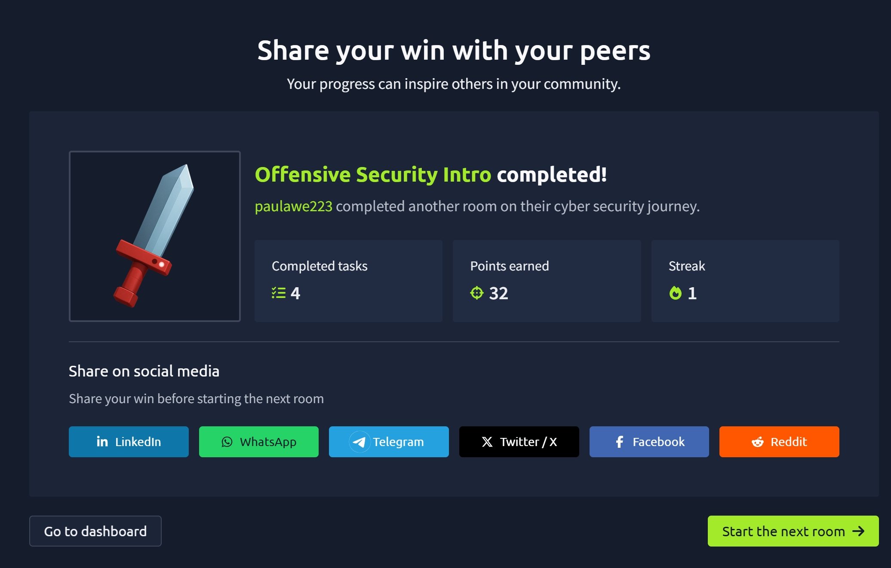

# TryHackMe – Offensive Security Intro

## 🎯 Objective
Understand the fundamentals of offensive security and how ethical hackers identify and exploit vulnerabilities in systems.

---

## 🧪 Lab Summary
This room introduced the concept of offensive security, focusing on how attackers think and operate. It demonstrated how vulnerabilities in systems can be exploited and emphasized the importance of ethical hacking in cybersecurity.

---

## 🛠️ Key Concepts Learned

- Offensive security involves actively testing systems to find vulnerabilities
- Ethical hackers simulate real-world attacks to improve security
- Vulnerabilities can exist in systems, networks, and applications
- Understanding attacker mindset is critical in cybersecurity

---

## 🧠 What I Learned

- Cybersecurity is not just defensive — it also involves understanding attacks
- Offensive security helps organizations identify weaknesses before attackers do
- Hands-on labs are essential for building real cybersecurity skills

---

## 📸 Proof of Completion

---

## 📊 Lab Details

- Platform: TryHackMe
- Room: Offensive Security Intro
- Tasks Completed: 4
- Points Earned: 32

---

## 🧠 Reflection

This lab gave me my first practical insight into how offensive security works. I now understand the importance of thinking like an attacker and how this knowledge is used to strengthen system security.

---

## 🚀 Next Steps

- Continue TryHackMe learning path
- Learn basic tools like Nmap
- Explore beginner penetration testing concepts
