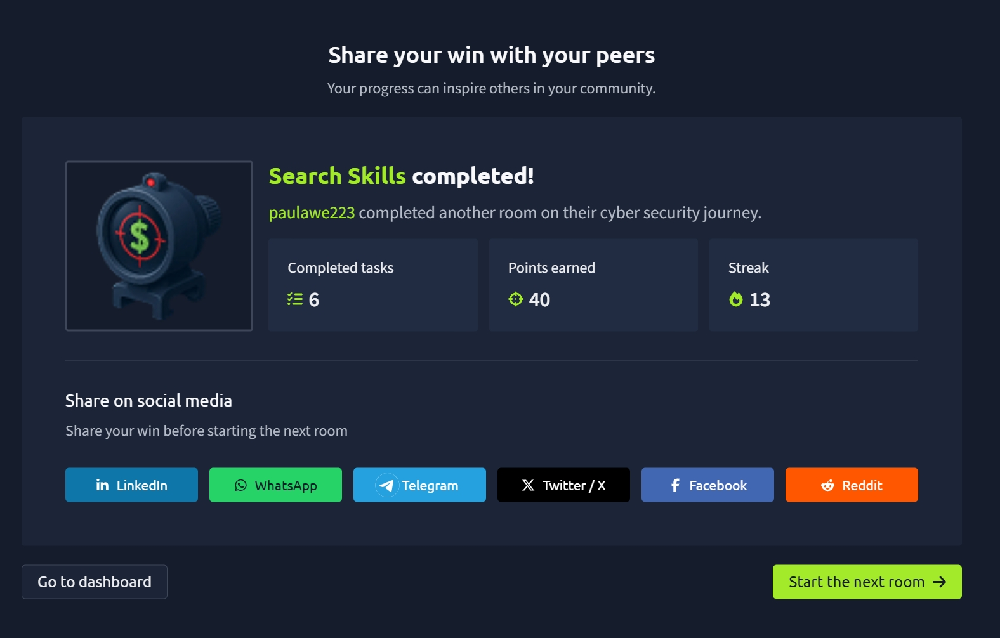

# Search Skills

## 🧠 What I Learned

In this room, I learned that one of the most valuable skills in cybersecurity is knowing **where** to search for information. Whether you're investigating a security incident, researching a vulnerability, or learning how a tool works, being able to quickly find reliable information is just as important as having technical knowledge.

I was introduced to several websites and resources that cybersecurity professionals regularly use to gather threat intelligence, research vulnerabilities, verify suspicious files, and understand security tools.

---

## Why Search Skills Matter

Cybersecurity professionals constantly need to research:

- New vulnerabilities
- Threat actors
- Exploits
- Malware
- Security tools
- Technical documentation

Instead of relying solely on search engines, there are specialized resources that provide much more accurate and up-to-date information.

Learning how to use these resources efficiently can save time and improve the quality of investigations.

---

## Shodan

One of the most interesting tools I learned about was **Shodan**.

Unlike traditional search engines that index websites, Shodan searches internet-connected devices and services.

It continuously scans the internet to identify publicly accessible devices such as:

- Web servers
- Routers
- Industrial Control Systems (ICS)
- IoT devices
- Security cameras
- Network appliances

This makes it useful for identifying exposed systems and gathering information during security assessments.

### Useful Shodan Filters

Some useful filters include:

- `country:` – Search within a specific country
- `port:` – Search for services running on a particular port
- `hostname:` – Search for a specific hostname
- `org:` – Search systems belonging to a specific organization

These filters help narrow search results during reconnaissance and vulnerability assessments.

---

## VirusTotal

I also learned about **VirusTotal**, a popular threat intelligence platform.

VirusTotal allows users to upload:

- Files
- URLs
- Domains
- File hashes

It then scans them using multiple antivirus engines and security vendors to determine whether they have been identified as malicious.

Although VirusTotal should not be treated as the final authority, it provides an excellent way to quickly check suspicious files and gather threat intelligence.

---

## Common Vulnerabilities and Exposures (CVE)

Another important concept introduced in this room was the **Common Vulnerabilities and Exposures (CVE)** system.

Each publicly known vulnerability receives a unique identifier, such as:

```
CVE-2025-55182
```

These identifiers allow security professionals around the world to refer to the same vulnerability consistently.

---

## CVSS Scoring

I also learned about the **Common Vulnerability Scoring System (CVSS)**.

CVSS helps organizations determine how serious a vulnerability is by considering factors such as:

- Impact
- Complexity
- Exploitability

Organizations use these scores to prioritize which vulnerabilities should be addressed first.

Higher-risk vulnerabilities are typically remediated before lower-risk ones.

---

## Exploit Databases

The room introduced **ExploitDB**, which contains publicly available Proof-of-Concept (PoC) exploits for known vulnerabilities.

Security researchers use these PoCs to:

- Validate vulnerabilities
- Understand exploitation techniques
- Test defensive controls

These resources are valuable for both offensive and defensive security professionals.

---

## Technical Documentation

One of the most important lessons from this room was that **official documentation should always be my first source of information**.

When learning a new tool or troubleshooting an issue, the official documentation is usually:

- More accurate
- Better maintained
- More up to date

This helps avoid relying on outdated or incorrect third-party tutorials.

---

## Linux Man Pages

I learned that Linux provides built-in documentation through **manual (man) pages**.

To view documentation for a command:

```bash
man <command>
```

Example:

```bash
man nc
```

The manual pages explain:

- Command purpose
- Available options
- Syntax
- Examples

This makes them one of the most useful resources when working in Linux.

---

## GitHub as a Security Resource

I also learned that GitHub is more than a code hosting platform.

Many cybersecurity researchers publish:

- Proof-of-Concept exploits
- Detection scripts
- Security tools
- Research papers
- Vulnerability analysis

Searching GitHub using a CVE identifier often reveals useful resources related to that vulnerability.

However, it's important to verify repositories before running any code because some PoCs may be incomplete, outdated, or even malicious.

---

## Key Resources I Learned

- Shodan
- VirusTotal
- CVE Database
- CVSS
- ExploitDB
- Official Product Documentation
- Linux Man Pages
- GitHub

---

## Key Takeaways

From this room I learned that:

- Effective searching is an essential cybersecurity skill.
- Specialized security resources provide more accurate information than general search engines.
- Shodan helps identify internet-connected devices and exposed services.
- VirusTotal allows security professionals to analyze suspicious files and URLs.
- CVE identifiers provide a universal reference for vulnerabilities.
- CVSS scores help organizations prioritize risk.
- Official documentation should always be my primary reference when learning new tools.
- Linux man pages provide built-in documentation for commands.
- GitHub is an excellent source for security research, PoCs, and technical resources, but downloaded code should always be verified before execution.

This room showed me that becoming a better cybersecurity professional isn't just about knowing tools—it's also about knowing where to find trustworthy information quickly and efficiently.

---

## 📸 Proof of Completion


