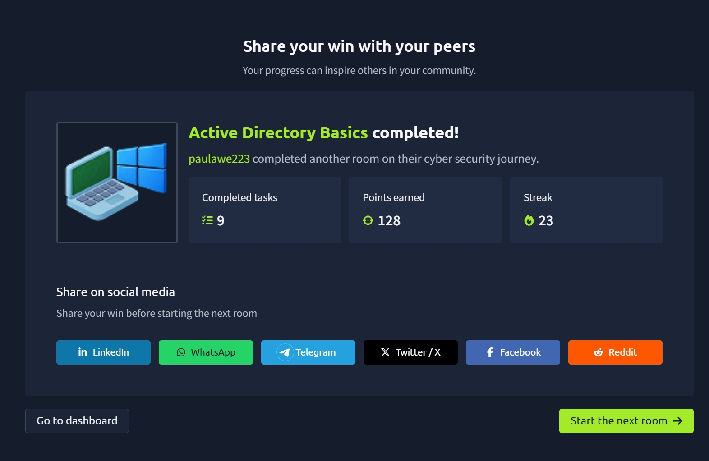

# Active Directory Basics

## 🧠 What I Learned

In this room, I learned the fundamentals of **Microsoft Active Directory (AD)** and why it is one of the most important technologies used in enterprise environments.

Active Directory allows organizations to centrally manage users, computers, groups, security policies, and network resources from a single location instead of configuring every computer individually.

Since most corporate Windows environments rely on Active Directory, understanding how it works is essential for both blue team and red team roles.

---

## What is Active Directory?

Active Directory (AD) is Microsoft's directory service used to manage users, computers, groups, and other network resources within a Windows domain.

The server that hosts Active Directory is called a **Domain Controller (DC)**.

Instead of creating user accounts separately on every computer, administrators create accounts once in Active Directory, allowing users to authenticate from any domain-joined computer.

---

## Windows Domains

A Windows Domain is a collection of users, computers, and resources managed centrally through Active Directory.

Using a domain provides several advantages:

- Centralized identity management
- Centralized authentication
- Easier administration
- Consistent security policies
- Simplified user management

Without a domain, administrators would need to manage every computer individually, which becomes impractical in large organizations.

---

## Active Directory Objects

Everything inside Active Directory is represented as an object.

Common object types include:

- Users
- Computers
- Groups
- Printers
- Shared folders
- Service accounts

These objects can be managed centrally through the Domain Controller.

---

## Users

User accounts represent people or services that need access to network resources.

There are generally two types of users:

- Regular user accounts for employees
- Service accounts used by applications and Windows services

Users are considered **security principals**, meaning they can authenticate and receive permissions to access resources.

---

## Machine Accounts

Every computer joined to a domain automatically receives its own machine account.

Machine accounts:

- End with a dollar sign (`$`)
- Automatically rotate strong passwords
- Authenticate computers to the domain

Example:

```
DC01$
```

These accounts help computers securely communicate with Active Directory.

---

## Security Groups

Security Groups simplify permission management.

Instead of assigning permissions to each individual user, administrators assign permissions to groups and then add users to those groups.

Examples include:

- Domain Admins
- Domain Users
- Domain Computers
- Server Operators
- Backup Operators
- Account Operators

A user can belong to multiple security groups at the same time.

---

## Organizational Units (OUs)

Organizational Units (OUs) are containers used to organize users and computers.

Many organizations structure OUs by department, such as:

- IT
- Sales
- Marketing
- Management
- Research & Development

OUs make it easier to apply policies to groups of users instead of configuring everyone individually.

Unlike security groups, a user belongs to only one OU at a time.

---

## Security Groups vs Organizational Units

One important lesson was understanding the difference between Groups and OUs.

### Organizational Units

Used for:

- Organizing objects
- Applying Group Policies
- Administrative delegation

### Security Groups

Used for:

- Granting permissions
- Controlling access to files
- Shared folders
- Printers
- Applications

In short:

- **OUs organize objects**
- **Groups grant permissions**

---

## Managing Users

Using **Active Directory Users and Computers**, administrators can:

- Create users
- Delete users
- Modify user accounts
- Reset passwords
- Organize users into OUs

I also learned that OUs are protected against accidental deletion by default, and administrators must disable this protection before deleting them.

---

## Delegation

Delegation allows administrators to grant limited administrative privileges without making someone a Domain Admin.

For example, Help Desk staff can be given permission to:

- Reset passwords
- Unlock accounts
- Manage users within specific OUs

This follows the Principle of Least Privilege by giving users only the permissions they need.

---

## Managing Computers

Computers that join a domain are automatically placed into the **Computers** container.

To improve management, organizations often create dedicated OUs such as:

- Workstations
- Servers
- Domain Controllers

Separating devices makes it easier to apply different security policies to each category.

---

## Group Policy Objects (GPOs)

One of the most powerful Active Directory features is **Group Policy**.

A **Group Policy Object (GPO)** is a collection of settings that can automatically configure users and computers.

Examples include:

- Password policies
- Desktop restrictions
- Windows Updates
- Firewall settings
- Software deployment
- Security configurations

Instead of configuring every computer manually, administrators apply a GPO once, and it automatically affects all devices within the linked OU.

---

## Group Policy Management

I learned that administrators use **Group Policy Management** to:

- Create GPOs
- Edit policies
- Link GPOs to OUs
- Apply security filtering

A GPO linked to a parent OU also affects any child OUs beneath it.

---

## SYSVOL

Group Policies are distributed across the domain through a shared folder called:

```
SYSVOL
```

Every domain controller replicates this folder so that all systems receive consistent policy updates.

---

## Key Takeaways

From this room I learned that:

- Active Directory centralizes the management of users and computers.
- Domain Controllers host Active Directory services.
- Every domain computer has its own machine account.
- Security Groups are used for assigning permissions.
- Organizational Units are used to organize objects and apply policies.
- Delegation allows limited administrative privileges without granting full Domain Admin rights.
- Group Policy Objects automate security and system configuration across an organization.
- SYSVOL distributes Group Policies to domain-joined systems.
- Active Directory is the foundation of most enterprise Windows environments and a critical technology for both system administrators and cybersecurity professionals.

This room gave me a solid understanding of how enterprise Windows environments are structured and how administrators securely manage large numbers of users and devices.

---

## 📸 Proof of Completion


