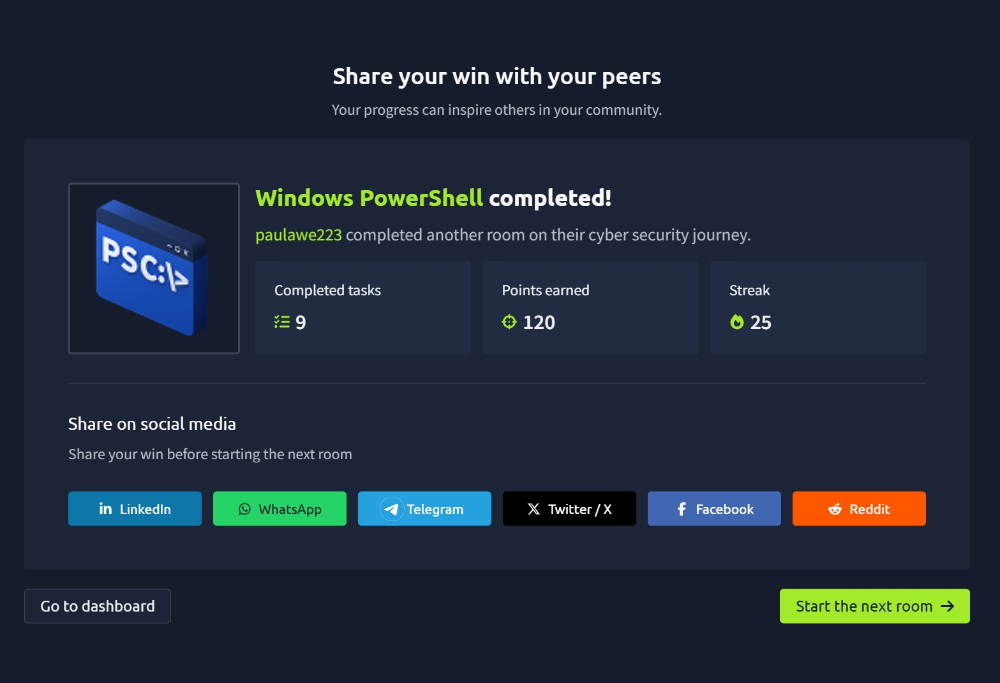

# Windows PowerShell

## 🧠 What I Learned

In this room, I learned the fundamentals of **Windows PowerShell**, Microsoft's powerful command-line shell and scripting language used for system administration, automation, and cybersecurity.

Unlike the traditional Windows Command Prompt, PowerShell works with **objects instead of plain text**, allowing administrators and security professionals to retrieve, manipulate, and automate system information much more efficiently.

PowerShell is widely used by system administrators, security engineers, incident responders, penetration testers, and malware analysts because of its deep integration with the Windows operating system.

---

# What is PowerShell?

PowerShell is Microsoft's cross-platform automation framework that combines:

- A command-line shell
- A scripting language
- A configuration management framework

Originally developed only for Windows, PowerShell is now available on:

- Windows
- Linux
- macOS

This makes it one of the most versatile administration tools available today.

---

# Why PowerShell is Different

One of the biggest differences between Command Prompt and PowerShell is that PowerShell works with **objects** rather than plain text.

Objects contain:

- Properties (information)
- Methods (actions)

For example, instead of simply displaying text, a PowerShell command can return an object containing detailed information that can be filtered, sorted, or passed directly into another command.

This object-oriented design makes PowerShell significantly more powerful than the traditional Windows Command Prompt.

---

# Cmdlets

PowerShell commands are called **cmdlets** (pronounced *command-lets*).

They follow a consistent naming convention:

```
Verb-Noun
```

Examples include:

```
Get-Content
Set-Location
Get-Process
Get-Service
Get-ComputerInfo
```

This naming convention makes commands easy to understand because the verb describes the action while the noun identifies what the command operates on.

---

# Discovering Commands

I learned several useful cmdlets for exploring PowerShell itself.

### List Available Commands

```powershell
Get-Command
```

Displays all available cmdlets, functions, aliases, and scripts available in the current PowerShell session.

---

### Get Help

```powershell
Get-Help Get-Date
```

Displays detailed documentation for a command.

Helpful options include:

```powershell
Get-Help Get-Date -Examples
Get-Help Get-Date -Detailed
Get-Help Get-Date -Full
Get-Help Get-Date -Online
```

This built-in documentation makes learning PowerShell much easier.

---

### View Aliases

```powershell
Get-Alias
```

Displays shortcut names for PowerShell commands.

Examples:

```
dir → Get-ChildItem

cd → Set-Location

cat → Get-Content
```

These aliases make it easier for users transitioning from Command Prompt or Linux.

---

# Installing Additional Modules

PowerShell can be extended with additional modules from the PowerShell Gallery.

To search for modules:

```powershell
Find-Module
```

To install one:

```powershell
Install-Module
```

This allows PowerShell's functionality to grow far beyond its default capabilities.

---

# Navigating the File System

I learned several cmdlets used to manage files and directories.

### List Files

```powershell
Get-ChildItem
```

Equivalent to:

```
dir
```

or

```
ls
```

---

### Change Directory

```powershell
Set-Location
```

Equivalent to:

```
cd
```

---

### Create Files or Folders

```powershell
New-Item
```

Unlike Command Prompt, the same cmdlet can create either files or directories depending on the parameters used.

---

### Delete Files or Folders

```powershell
Remove-Item
```

Removes both files and directories.

---

### Copy Files

```powershell
Copy-Item
```

---

### Move Files

```powershell
Move-Item
```

---

### Display File Contents

```powershell
Get-Content
```

Equivalent to:

```
type
```

or

```
cat
```

---

# Piping Objects

One of PowerShell's most powerful features is **piping**.

Instead of passing plain text between commands, PowerShell passes complete objects.

Example:

```powershell
Get-ChildItem | Sort-Object Length
```

This retrieves files and sorts them by size.

Because objects retain their properties, PowerShell pipelines are much more flexible than traditional command-line pipelines.

---

# Filtering and Sorting Data

PowerShell provides several cmdlets for processing information.

### Sort Objects

```powershell
Sort-Object
```

Sorts objects using one or more properties.

---

### Filter Objects

```powershell
Where-Object
```

Examples include filtering by:

- File extension
- File name
- Size
- Any object property

Common comparison operators include:

- `-eq` (equal)
- `-ne` (not equal)
- `-gt` (greater than)
- `-ge` (greater than or equal)
- `-lt` (less than)
- `-le` (less than or equal)
- `-like` (pattern matching)

---

### Select Properties

```powershell
Select-Object
```

Allows specific properties to be displayed instead of the full object.

---

### Search File Contents

```powershell
Select-String
```

Similar to:

```
grep
```

or

```
findstr
```

Supports regular expressions for advanced searching.

---

# Gathering System Information

PowerShell includes powerful cmdlets for system enumeration.

### Display Computer Information

```powershell
Get-ComputerInfo
```

Displays:

- Operating System
- BIOS
- Hardware
- Windows Version
- Installation Information

---

### View Local Users

```powershell
Get-LocalUser
```

Lists all local user accounts.

---

### Display Network Configuration

```powershell
Get-NetIPConfiguration
```

Shows:

- IP Address
- DNS Server
- Default Gateway
- Network Adapter

---

### Display IP Addresses

```powershell
Get-NetIPAddress
```

Shows every IP address configured on the system, including IPv4 and IPv6 addresses.

---

# Real-Time System Analysis

PowerShell makes monitoring a running system much easier.

### Running Processes

```powershell
Get-Process
```

Displays:

- Process Name
- CPU Usage
- Memory Usage
- Process ID

Useful for troubleshooting and incident response.

---

### Services

```powershell
Get-Service
```

Shows:

- Running services
- Stopped services
- Service status

This is valuable when investigating suspicious or unexpected services.

---

### Network Connections

```powershell
Get-NetTCPConnection
```

Displays active TCP connections.

Useful during:

- Threat hunting
- Malware analysis
- Incident response

It helps identify unexpected outbound or inbound network connections.

---

### File Integrity

```powershell
Get-FileHash
```

Generates cryptographic hashes for files.

Commonly used to:

- Verify file integrity
- Detect tampering
- Compare malware samples

---

### Alternate Data Streams (ADS)

PowerShell can also display **Alternate Data Streams (ADS)** attached to NTFS files.

This is particularly useful during forensic investigations because malware sometimes hides data inside ADS.

---

# PowerShell Scripting

One of the biggest strengths of PowerShell is automation.

Scripts allow administrators and security professionals to execute multiple commands automatically.

PowerShell scripting can be used for:

- Automating administrative tasks
- System configuration
- Log analysis
- Threat hunting
- Malware analysis
- Incident response
- Security monitoring

Both offensive and defensive security teams rely heavily on PowerShell scripting.

---

# Remote Administration

One of the most powerful cmdlets introduced was:

```powershell
Invoke-Command
```

This cmdlet executes commands on remote systems.

It can be used to:

- Run scripts remotely
- Execute individual commands
- Automate administration across multiple computers

For system administrators, this greatly simplifies remote management.

For penetration testers, it can also be used during authorized engagements to execute commands on remote systems.

---

# Key Takeaways

From this room I learned that:

- PowerShell is Microsoft's object-oriented command-line shell and scripting language.
- Cmdlets follow a consistent **Verb-Noun** naming convention.
- `Get-Command`, `Get-Help`, and `Get-Alias` are essential for learning PowerShell.
- PowerShell works with objects rather than plain text, making automation far more powerful.
- File management is performed using cmdlets such as `Get-ChildItem`, `Set-Location`, `New-Item`, `Copy-Item`, and `Remove-Item`.
- PowerShell pipelines pass objects between commands for advanced filtering and sorting.
- `Where-Object`, `Sort-Object`, `Select-Object`, and `Select-String` make data analysis much easier.
- PowerShell provides powerful cmdlets for gathering system, user, network, and process information.
- `Get-Process`, `Get-Service`, `Get-NetTCPConnection`, and `Get-FileHash` are valuable tools during incident response and threat hunting.
- PowerShell scripting is an essential skill for both offensive and defensive cybersecurity professionals.
- `Invoke-Command` enables powerful remote administration and automation.

This room showed me why PowerShell is one of the most important tools in Windows administration and cybersecurity. Its ability to automate tasks, manage systems, and analyze information efficiently makes it an essential skill for anyone pursuing a career in IT or cybersecurity.

---

## 📸 Proof of Completion


