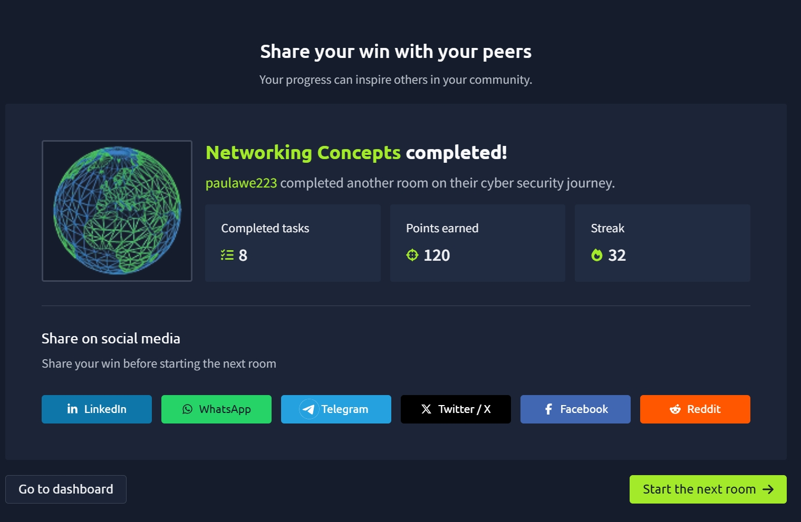

# Networking Concepts

The **Networking Concepts** room introduced me to the foundations of computer networking. I learned how devices communicate across networks, how data travels from one computer to another, and why protocols like TCP/IP are essential for reliable communication. This room also explained the OSI and TCP/IP models, IP addressing, routing, TCP vs UDP, encapsulation, and how to communicate with services using Telnet. :contentReference[oaicite:0]{index=0}

---

## 🧠 What I Learned

### 🌐 The OSI Model

The OSI (Open Systems Interconnection) model is a conceptual framework that explains how data moves through a network using **seven layers**. Each layer has a specific responsibility and works together to ensure successful communication between devices. :contentReference[oaicite:1]{index=1}

The seven layers are:

1. Physical
2. Data Link
3. Network
4. Transport
5. Session
6. Presentation
7. Application

A mnemonic that helped me remember the layers is:

> **Please Do Not Throw Spinach Pizza Away**

I also learned that networking devices and security tools are often described by the OSI layer they operate on, such as a **Layer 3 switch** or a **Layer 7 firewall**. :contentReference[oaicite:2]{index=2}

---

### ⚡ Layer 1 – Physical Layer

This layer is responsible for the physical transmission of data.

Examples include:

- Ethernet cables
- Fibre optic cables
- Wi-Fi radio signals
- Electrical and wireless communication

Without this layer, no data can physically travel between devices. :contentReference[oaicite:3]{index=3}

---

### 🔗 Layer 2 – Data Link Layer

The Data Link layer enables communication between devices on the **same local network**.

I learned about:

- Ethernet (802.3)
- Wi-Fi (802.11)
- MAC addresses

A MAC address uniquely identifies a network interface and is used when devices communicate within the same network segment. :contentReference[oaicite:4]{index=4}

---

### 🌍 Layer 3 – Network Layer

The Network layer is responsible for moving packets between **different networks**.

Key responsibilities include:

- Logical addressing
- Routing
- Selecting the best path for packets

Protocols operating here include:

- IP
- ICMP
- IPSec VPNs

Routers work primarily at this layer. :contentReference[oaicite:5]{index=5}

---

### 🚚 Layer 4 – Transport Layer

This layer provides end-to-end communication between applications.

The two major protocols are:

- TCP
- UDP

I learned that the Transport layer also handles:

- Segmentation
- Flow control
- Error correction

:contentReference[oaicite:6]{index=6}

---

### 💬 Layers 5–7

These upper layers focus on communication between applications.

**Session Layer**
- Establishes and maintains communication sessions.

**Presentation Layer**
- Handles encryption, compression, and data formatting.

**Application Layer**
- Provides services directly to applications like web browsers and email clients.

Protocols include:

- HTTP
- HTTPS
- DNS
- FTP
- SMTP
- IMAP

:contentReference[oaicite:7]{index=7}

---

## 🌍 TCP/IP Model

Unlike the OSI model, the TCP/IP model is the one actually used on modern networks.

Its four layers are:

- Application
- Transport
- Internet
- Link

The TCP/IP model combines the OSI Session, Presentation, and Application layers into a single Application layer. :contentReference[oaicite:8]{index=8}

---

## 📍 IP Addresses

Every device connected to a network requires a unique IP address.

I learned:

- IPv4 addresses contain four octets.
- Each octet ranges from 0–255.
- Every device needs a unique IP address for communication.

Example:

```
192.168.1.1
```

I also learned that:

- `.0` represents the network address.
- `.255` represents the broadcast address.

:contentReference[oaicite:9]{index=9}

---

## 🏠 Public vs Private IP Addresses

Private IP addresses are used inside local networks and are not directly accessible from the Internet.

The three private IPv4 ranges are:

- 10.0.0.0 – 10.255.255.255
- 172.16.0.0 – 172.31.255.255
- 192.168.0.0 – 192.168.255.255

To access the Internet, private addresses rely on a router performing Network Address Translation (NAT). :contentReference[oaicite:10]{index=10}

---

## 🛣️ Routing

Routers determine the best path for packets to travel between networks.

I liked the comparison made in the room:

A router works like a **post office**, forwarding parcels to the correct destination until they reach the recipient.

:contentReference[oaicite:11]{index=11}

---

## ⚖️ TCP vs UDP

One of the most important lessons was understanding the difference between TCP and UDP.

### UDP

- Connectionless
- Faster
- No guarantee of delivery
- No acknowledgements

It's useful when speed is more important than reliability.

Examples include:

- Streaming
- Voice calls
- Gaming

### TCP

TCP is connection-oriented.

Before sending data, it establishes a connection using the **Three-Way Handshake**:

1. SYN
2. SYN-ACK
3. ACK

TCP also:

- Numbers packets
- Detects missing packets
- Resends lost packets
- Guarantees reliable delivery

Examples include:

- Web browsing
- Email
- File transfers

:contentReference[oaicite:12]{index=12}

---

## 📦 Encapsulation

Encapsulation is the process where each networking layer adds its own header before passing data to the next layer.

The journey looks like this:

Application Data

↓

TCP Segment / UDP Datagram

↓

IP Packet

↓

Ethernet/Wi-Fi Frame

At the receiving computer, this process happens in reverse until the application receives the original data.

:contentReference[oaicite:13]{index=13}

---

## 🚀 The Life of a Packet

The room explained how a packet travels across the Internet.

A simplified process is:

1. The application creates data.
2. TCP establishes a connection.
3. IP adds source and destination addresses.
4. The Data Link layer creates a frame.
5. Routers forward the packet.
6. The destination reverses the encapsulation process.

Seeing how every layer works together made networking much easier to understand. :contentReference[oaicite:14]{index=14}

---

## 💻 Using Telnet

I also learned how Telnet can be used to connect directly to TCP services.

Examples included connecting to:

- Echo Server (Port 7)
- Daytime Server (Port 13)
- HTTP Server (Port 80)

Although Telnet is no longer considered secure for administration, it's still useful for understanding how TCP connections work and for testing open ports.

:contentReference[oaicite:15]{index=15}

---

## 🎯 Key Takeaways

- Learned the seven layers of the OSI model.
- Understood how the TCP/IP model maps to the OSI model.
- Learned how IP addressing and subnetting work.
- Understood the difference between public and private IP addresses.
- Learned how routers forward packets.
- Understood the differences between TCP and UDP.
- Learned how encapsulation prepares data for transmission.
- Followed the complete journey of a network packet.
- Used Telnet to communicate with TCP services.

---

## 📸 Proof of Completion


