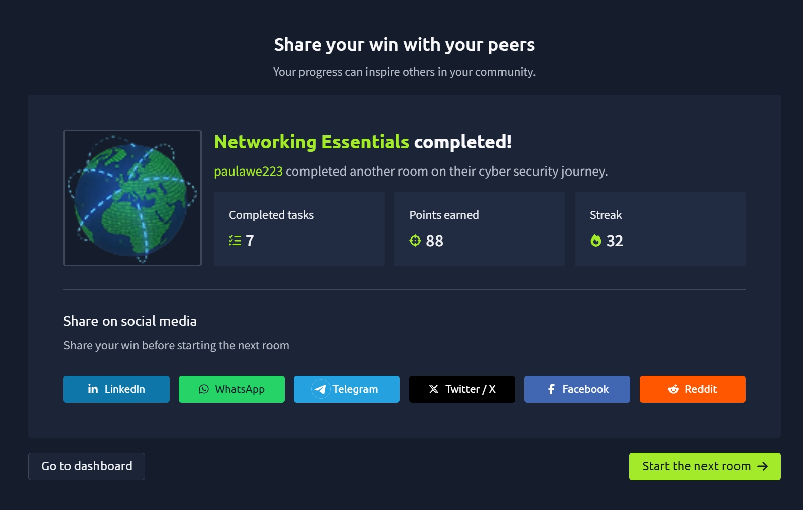

# Networking Essentials

The **Networking Essentials** room expanded on the networking fundamentals introduced in the previous room. I learned how devices automatically obtain network settings, how computers discover each other's MAC addresses, how routers translate private IP addresses to public ones, and how tools like **ping** and **traceroute** help troubleshoot network connectivity. This room also introduced common routing protocols used to move data across the Internet. :contentReference[oaicite:0]{index=0}

---

## 🧠 What I Learned

### 📡 Dynamic Host Configuration Protocol (DHCP)

One of the first things I learned is how devices automatically receive network settings whenever they connect to a new network.

Instead of manually configuring:

- IP Address
- Subnet Mask
- Default Gateway
- DNS Server

a **DHCP server** assigns them automatically.

DHCP operates over **UDP**, using:

- **Server:** Port **67**
- **Client:** Port **68**

This prevents IP conflicts and makes network administration much easier. :contentReference[oaicite:1]{index=1}

---

### 🔄 The DHCP DORA Process

DHCP follows four simple steps known as **DORA**:

1. **Discover** – The client searches for a DHCP server.
2. **Offer** – The server offers an available IP address.
3. **Request** – The client requests to use the offered address.
4. **Acknowledge** – The server confirms the assignment.

Remembering **DORA** makes it much easier to understand how devices join a network automatically. :contentReference[oaicite:2]{index=2}

---

## 🔗 Address Resolution Protocol (ARP)

Computers communicate using **IP addresses**, but Ethernet and Wi-Fi actually deliver data using **MAC addresses**.

ARP bridges this gap by translating an IP address into its corresponding MAC address.

The process works like this:

1. A device broadcasts an **ARP Request** asking, "Who has this IP address?"
2. The target device replies with an **ARP Reply** containing its MAC address.
3. Communication can then begin.

I also learned that ARP packets are sent directly inside Ethernet frames instead of TCP or UDP packets. :contentReference[oaicite:3]{index=3}

---

## 📶 Internet Control Message Protocol (ICMP)

ICMP is mainly used for:

- Network diagnostics
- Error reporting
- Connectivity testing

Two common tools that rely on ICMP are:

- **ping**
- **traceroute**

These tools are extremely useful when troubleshooting network issues. :contentReference[oaicite:4]{index=4}

---

## 🏓 Ping

The **ping** command tests whether another device is reachable.

It works by:

1. Sending an **ICMP Echo Request**
2. Receiving an **ICMP Echo Reply**

Ping also measures:

- Round-trip time (RTT)
- Packet loss
- Network latency

Example:

```bash
ping 192.168.11.1 -c 4
```

This sends four ICMP requests and reports the network statistics. :contentReference[oaicite:5]{index=5}

---

## 🛣️ Traceroute

Traceroute shows the path packets take across the Internet.

It works by gradually increasing the **TTL (Time To Live)** value.

Each router decreases the TTL by one.

When TTL reaches zero, the router responds with an **ICMP Time Exceeded** message, allowing traceroute to discover every router along the path.

Example:

```bash
traceroute example.com
```

This helps identify where connectivity problems occur between two systems. :contentReference[oaicite:6]{index=6}

---

## 🌍 Routing

Routers decide the best path for packets travelling between different networks.

Although routing algorithms are complex, I was introduced to several important routing protocols:

- **OSPF (Open Shortest Path First)**
- **EIGRP (Enhanced Interior Gateway Routing Protocol)**
- **BGP (Border Gateway Protocol)**
- **RIP (Routing Information Protocol)**

I learned that **BGP** is the protocol responsible for routing traffic across the Internet between different Internet Service Providers (ISPs). :contentReference[oaicite:7]{index=7}

---

## 🌐 Network Address Translation (NAT)

One of the most useful concepts I learned was **NAT**.

Instead of assigning a public IP address to every device, NAT allows multiple private devices to share a single public IP address.

For example:

- Laptop
- Phone
- Smart TV
- Gaming console

can all browse the Internet using one public IP assigned to the router.

The router keeps a translation table that maps:

- Private IP + Port
- Public IP + Port

This helps conserve IPv4 addresses while allowing many devices to communicate with the Internet simultaneously. :contentReference[oaicite:8]{index=8}

---

## 🎯 Key Takeaways

- Learned how DHCP automatically configures network settings.
- Memorized the DHCP **DORA** process.
- Understood how ARP translates IP addresses into MAC addresses.
- Learned how ICMP supports network diagnostics.
- Used **ping** to test connectivity.
- Learned how **traceroute** discovers the path packets take across networks.
- Became familiar with common routing protocols including OSPF, EIGRP, BGP, and RIP.
- Understood how NAT allows many private devices to share a single public IP address.

---

## 📸 Proof of Completion


