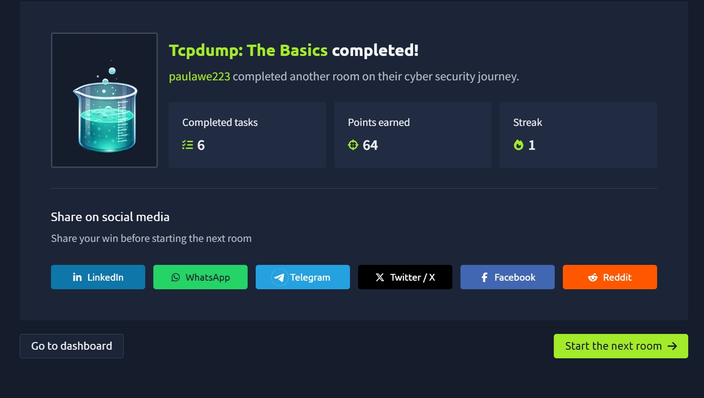

# Tcpdump: The Basics

The **Tcpdump: The Basics** room introduced me to packet capture and network traffic analysis directly from the command line.

After learning how to analyze packets visually with Wireshark, this room showed me how similar network analysis tasks can be performed using **Tcpdump** in the terminal.

I learned how to capture packets, select network interfaces, save and read PCAP files, filter traffic by hosts, ports, and protocols, combine filters with logical operators, filter using TCP flags, and control how packet data is displayed.

---

## 🧠 What I Learned

### 📡 What is Tcpdump?

**Tcpdump** is a command-line packet analyzer used to capture and inspect network traffic.

Unlike graphical tools such as Wireshark, Tcpdump works directly from the terminal, making it useful when working with:

- Linux systems
- Remote servers
- Command-line environments
- Network troubleshooting
- Security investigations
- Packet capture files

Tcpdump uses the **libpcap** library, which also serves as the foundation for several other networking tools.

One thing this room reinforced for me is that packet capture allows me to actually see the network conversations that normally happen behind the scenes.

Examples include:

```text
ARP requests
TCP handshakes
DNS queries
ICMP messages
TCP/UDP communication
```

---

# 🖥️ Basic Packet Capture

Tcpdump can be started without any arguments:

```bash
tcpdump
```

However, in a real investigation, I normally need to specify things such as:

```text
Which interface to monitor
What traffic to capture
How many packets to capture
Where to save the packets
How the packets should be displayed
```

---

# 🔌 Selecting a Network Interface

Before capturing traffic, I need to determine which network interface Tcpdump should monitor.

I can view available interfaces using:

```bash
ip address show
```

or the shorter version:

```bash
ip a s
```

Then I can select an interface with:

```bash
tcpdump -i INTERFACE
```

For example:

```bash
tcpdump -i eth0
```

To capture traffic from all available interfaces:

```bash
tcpdump -i any
```

---

# 💾 Saving Captured Packets

Instead of only displaying captured packets on the screen, I can save them for later analysis.

The `-w` option writes captured traffic to a file:

```bash
tcpdump -w FILE
```

For example:

```bash
tcpdump -i eth0 -w traffic.pcap
```

The `.pcap` file can later be analyzed using Tcpdump or another packet analysis tool such as Wireshark.

---

# 📂 Reading PCAP Files

Tcpdump can also analyze previously captured packets.

The `-r` option reads packets from a file:

```bash
tcpdump -r FILE
```

For example:

```bash
tcpdump -r traffic.pcap
```

This is particularly useful when investigating previously captured network activity or analyzing traffic related to a security incident.

---

# 🔢 Limiting the Number of Packets

Without specifying a limit, Tcpdump continues capturing packets until I manually stop it.

I can stop a running capture using:

```text
CTRL + C
```

Alternatively, I can specify exactly how many packets I want to capture using:

```bash
-c COUNT
```

For example:

```bash
tcpdump -c 50
```

This captures only **50 packets**.

---

# 🌐 Preventing Name Resolution

By default, Tcpdump may try to resolve IP addresses into domain names.

I can disable this using:

```bash
-n
```

For example:

```bash
sudo tcpdump -i ens5 -c 5 -n
```

The `-nn` option goes further and prevents both IP address and port number resolution:

```bash
tcpdump -nn
```

This means Tcpdump will display actual values instead of translating something like:

```text
80 → http
```

---

# 📋 Verbose Output

Tcpdump provides different levels of output detail.

```bash
-v
```

provides verbose output.

More detail can be requested with:

```bash
-vv
```

and:

```bash
-vvv
```

The more `v` options I add, the more information Tcpdump displays about the packets.

---

# 🧪 Combining Capture Options

Tcpdump options can be combined depending on what I want to investigate.

For example:

```bash
tcpdump -i eth0 -c 50 -v
```

This:

```text
Listens on eth0
Captures 50 packets
Displays verbose packet information
```

Another example:

```bash
tcpdump -i wlo1 -w data.pcap
```

This captures traffic from the WiFi interface and saves it to:

```text
data.pcap
```

I can also capture traffic across every interface without name or port resolution:

```bash
tcpdump -i any -nn
```

---

# 🔎 Filtering Traffic

Capturing everything on a network can quickly produce thousands or even millions of packets.

Because of this, filtering is an important part of using Tcpdump.

Instead of examining everything, I can tell Tcpdump exactly which traffic I am interested in.

---

# 🖥️ Filtering by Host

I can capture traffic associated with a specific IP address or hostname using:

```bash
tcpdump host IP
```

or:

```bash
tcpdump host HOSTNAME
```

For example:

```bash
sudo tcpdump host example.com
```

I can also save that traffic:

```bash
sudo tcpdump host example.com -w http.pcap
```

An important thing I learned is that capturing packets normally requires **root privileges**, so `sudo` is commonly used.

---

# ➡️ Filtering by Source Host

If I only want packets coming **from** a particular host:

```bash
tcpdump src host IP
```

For example:

```bash
tcpdump src host 192.168.1.10
```

---

# ⬅️ Filtering by Destination Host

If I only want packets being sent **to** a particular host:

```bash
tcpdump dst host IP
```

For example:

```bash
tcpdump dst host 192.168.1.10
```

This distinction is useful when investigating the direction of network communication.

---

# 🚪 Filtering by Port

Tcpdump can also filter packets based on port numbers.

For example, DNS commonly uses port:

```text
53
```

I can capture traffic associated with that port using:

```bash
sudo tcpdump -i ens5 port 53 -n
```

This allows me to focus specifically on DNS traffic.

---

## Source Port

To filter by a particular source port:

```bash
tcpdump src port PORT_NUMBER
```

Example:

```bash
tcpdump src port 53
```

---

## Destination Port

To filter by destination port:

```bash
tcpdump dst port PORT_NUMBER
```

Example:

```bash
tcpdump dst port 443
```

---

# 📡 Filtering by Protocol

Tcpdump also allows traffic to be filtered by protocol.

Some examples include:

```text
ip
ip6
tcp
udp
icmp
```

For example:

```bash
sudo tcpdump -i ens5 icmp -n
```

This displays only **ICMP traffic**.

The capture might reveal traffic such as:

```text
ICMP Echo Request
ICMP Echo Reply
ICMP Time Exceeded
```

These can be associated with commands such as:

```text
ping
traceroute
```

---

# 🧠 Logical Operators

One of the most useful things I learned was how to combine multiple filters.

Tcpdump supports logical operators such as:

```text
and
or
not
```

---

## AND

Both conditions must be true.

Example:

```bash
tcpdump host 1.1.1.1 and tcp
```

This captures TCP traffic associated with:

```text
1.1.1.1
```

---

## OR

Either condition can be true.

Example:

```bash
tcpdump udp or icmp
```

This captures:

```text
UDP traffic
OR
ICMP traffic
```

---

## NOT

This excludes traffic matching a condition.

Example:

```bash
tcpdump not tcp
```

This captures packets that are **not TCP**, which could include:

```text
UDP
ICMP
ARP
```

---

# 🔐 Filtering SSH Traffic

Filters can be combined to become much more specific.

For example:

```bash
tcpdump -i any tcp port 22
```

This:

```text
Listens on all interfaces
Filters TCP traffic
Filters port 22
```

Port 22 is commonly associated with **SSH**.

---

# ⏰ Filtering NTP Traffic

Another example:

```bash
tcpdump -i wlo1 udp port 123
```

This captures UDP traffic on:

```text
Port 123
```

which is associated with **Network Time Protocol (NTP)**.

---

# 🔒 Filtering HTTPS Traffic

A more specific filter from the room was:

```bash
tcpdump -i eth0 host example.com and tcp port 443 -w https.pcap
```

This combines several conditions:

```text
Interface → eth0
Host → example.com
Protocol → TCP
Port → 443
Output → https.pcap
```

This allows Tcpdump to capture HTTPS-related traffic associated with a particular host.

---

# 📖 Filtering Existing PCAP Files

Filters can also be applied while reading existing packet captures.

For example:

```bash
tcpdump -r traffic.pcap -c 5 -n
```

This:

```text
Reads traffic.pcap
Displays the first 5 packets
Disables IP address resolution
```

This is useful because I can capture traffic once and perform multiple investigations on the same PCAP afterward.

---

# 🔢 Counting Matching Packets

Tcpdump output can also be combined with other Linux commands.

For example:

```bash
tcpdump -r traffic.pcap src host 192.168.124.1 -n | wc
```

The `wc` command can be used to count the resulting output.

This reinforced how powerful command-line tools become when they are combined using pipes.

---

# 🎯 Advanced Filtering

Tcpdump provides more advanced ways to narrow down packet captures.

For example, packets can be filtered according to their length.

```bash
greater LENGTH
```

returns packets with a length greater than or equal to the specified value.

```bash
less LENGTH
```

returns packets with a length less than or equal to the specified value.

---

# 💻 Binary Operations

The room also introduced binary operations because they become useful when filtering packets using information stored in protocol headers.

The three operations covered were:

```text
&  → AND
|  → OR
!  → NOT
```

---

## Binary AND

The `&` operator returns `1` only when both bits are `1`.

```text
0 & 0 = 0
0 & 1 = 0
1 & 0 = 0
1 & 1 = 1
```

---

## Binary OR

The `|` operator returns `1` when at least one of the bits is `1`.

```text
0 | 0 = 0
0 | 1 = 1
1 | 0 = 1
1 | 1 = 1
```

---

## Binary NOT

The `!` operator reverses a bit:

```text
!0 = 1
!1 = 0
```

These concepts become important when examining individual bits inside protocol headers.

---

# 📦 Filtering Header Bytes

Tcpdump can filter packets based on the actual contents of protocol headers.

The general syntax is:

```text
proto[expr:size]
```

Where:

```text
proto → Protocol
expr  → Byte offset
size  → Number of bytes
```

Protocols can include:

```text
arp
ether
icmp
ip
ip6
tcp
udp
```

The byte offset starts at:

```text
0
```

which represents the first byte.

This showed me that Tcpdump filtering can go much deeper than simply filtering by IP address or port.

---

# 🚩 Filtering TCP Flags

One practical use of header filtering is examining **TCP flags**.

Tcpdump provides:

```text
tcp[tcpflags]
```

Some of the TCP flags I can reference include:

```text
tcp-syn
tcp-ack
tcp-fin
tcp-rst
tcp-push
```

---

## SYN Only

To capture packets where only the SYN flag is set:

```bash
tcpdump "tcp[tcpflags] == tcp-syn"
```

---

## SYN Flag Present

To capture packets where at least the SYN flag is set:

```bash
tcpdump "tcp[tcpflags] & tcp-syn != 0"
```

---

## SYN or ACK

To capture packets containing at least the SYN or ACK flag:

```bash
tcpdump "tcp[tcpflags] & (tcp-syn|tcp-ack) != 0"
```

This introduced me to how packet filters can examine specific fields and bits inside TCP headers.

---

# 👀 Controlling Packet Display

Tcpdump also provides several options for controlling how packet information appears in the terminal.

The room covered:

```text
-q
-e
-A
-xx
-X
```

---

# ⚡ Quick Output

The `-q` option produces shorter packet information.

```bash
tcpdump -r TwoPackets.pcap -q
```

This is useful when I don't need the full packet details and want a cleaner overview.

---

# 🔗 Displaying MAC Addresses

The `-e` option displays the **link-level header**.

```bash
tcpdump -r TwoPackets.pcap -e
```

This includes information such as:

```text
Source MAC Address
Destination MAC Address
Ethernet Type
```

This can be useful when analyzing protocols such as:

```text
ARP
DHCP
```

or when trying to identify the source of unusual traffic on a local network.

---

# 🔤 Displaying Packets as ASCII

The `-A` option displays packet data using ASCII:

```bash
tcpdump -r TwoPackets.pcap -A
```

ASCII is useful when packet contents contain readable text.

However, it becomes less useful when traffic is:

```text
Encrypted
Compressed
Non-text data
```

---

# 🔢 Displaying Packets in Hexadecimal

The `-xx` option displays packets in hexadecimal:

```bash
tcpdump -r TwoPackets.pcap -xx
```

Hexadecimal representation allows packet bytes to be examined regardless of whether the underlying data is readable text.

It also allows closer inspection of:

```text
Protocol headers
Packet fields
Raw packet contents
```

---

# 🔤 + 🔢 Hex and ASCII Together

Tcpdump can display both hexadecimal and ASCII representations using:

```bash
-X
```

Example:

```bash
tcpdump -r TwoPackets.pcap -X
```

This gives me both:

```text
Hexadecimal representation
+
ASCII representation
```

in the same output.

---

# 📌 Tcpdump Command Cheat Sheet

| Command | Purpose |
|---|---|
| `tcpdump -i INTERFACE` | Capture packets on a specific interface |
| `tcpdump -i any` | Capture from all interfaces |
| `tcpdump -w FILE` | Save packets to a file |
| `tcpdump -r FILE` | Read packets from a capture file |
| `tcpdump -c COUNT` | Capture a specific number of packets |
| `tcpdump -n` | Disable IP address resolution |
| `tcpdump -nn` | Disable IP and port resolution |
| `tcpdump -v` | Verbose output |
| `tcpdump host IP` | Filter by host |
| `tcpdump src host IP` | Filter by source host |
| `tcpdump dst host IP` | Filter by destination host |
| `tcpdump port PORT` | Filter by port |
| `tcpdump src port PORT` | Filter by source port |
| `tcpdump dst port PORT` | Filter by destination port |
| `tcpdump tcp` | Display TCP traffic |
| `tcpdump udp` | Display UDP traffic |
| `tcpdump icmp` | Display ICMP traffic |
| `tcpdump -q` | Display brief packet information |
| `tcpdump -e` | Include link-layer information |
| `tcpdump -A` | Display packet data as ASCII |
| `tcpdump -xx` | Display packet data as hexadecimal |
| `tcpdump -X` | Display packet data as hex and ASCII |

---

# 🧠 Key Takeaways

- Learned how Tcpdump captures network traffic from the command line.
- Learned how to identify and select network interfaces.
- Captured traffic from individual or all network interfaces.
- Learned how to save packet captures as PCAP files.
- Learned how to analyze previously captured PCAP files.
- Used `-c` to control the number of captured packets.
- Used `-n` and `-nn` to prevent unnecessary name resolution.
- Learned how to increase output verbosity.
- Filtered packets by host, source, destination, port, and protocol.
- Combined filters using `and`, `or`, and `not`.
- Filtered TCP, UDP, ICMP, SSH, DNS, NTP, and HTTPS-related traffic.
- Learned how Linux pipes can be combined with Tcpdump output.
- Learned the basics of binary AND, OR, and NOT operations.
- Learned how protocol header bytes can be referenced in filters.
- Used TCP flags such as SYN, ACK, FIN, RST, and PUSH in filtering.
- Learned how to display packet data in brief, ASCII, hexadecimal, or combined formats.

---

# 🎯 Why This Matters for Cybersecurity

Tcpdump gives me another way to investigate network traffic without depending on a graphical interface.

This is especially important when working with Linux servers, remote systems, or environments where Wireshark may not be available.

The filtering skills from this room can help with tasks such as:

```text
Network Troubleshooting
SOC Analysis
Incident Response
Threat Hunting
Network Forensics
Traffic Monitoring
Security Investigations
```

More importantly, Tcpdump helps reinforce the networking concepts I have been learning by allowing me to see protocols, IP addresses, ports, TCP flags, and packet contents directly from the command line.

Combined with Wireshark, it gives me both **GUI-based and command-line approaches to packet analysis**.

---

## 📸 Proof of Completion


