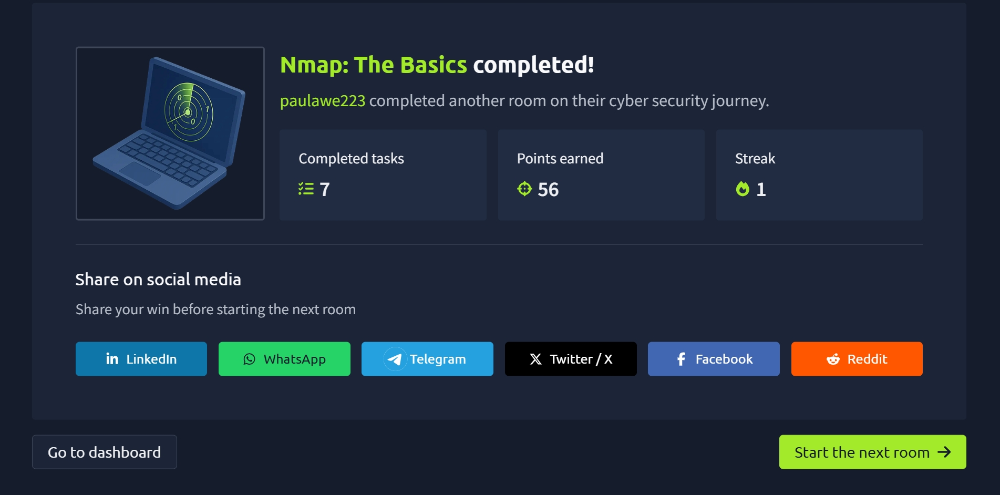

# Nmap: The Basics

In this TryHackMe room, I learned the fundamentals of **Nmap (Network Mapper)**, a powerful open-source network scanner used to discover live hosts, identify open ports, detect running services and their versions, and gather information about systems on a network.

The room also introduced different TCP and UDP scanning techniques, OS detection, scan timing, verbosity, and methods for saving Nmap scan results.

---

## 🧠 What I Learned

### 🔍 What is Nmap?

**Nmap (Network Mapper)** is an open-source network scanning tool used for network discovery and security auditing.

Instead of manually checking individual IP addresses and ports, Nmap can efficiently:

- Discover live hosts on a network
- Identify open TCP and UDP ports
- Detect running network services
- Determine service versions
- Estimate the operating system running on a target
- Control scan speed and timing
- Save scan results in different formats

Nmap is especially useful when working with networks containing many hosts and thousands of possible ports.

---

## 🌐 Specifying Targets in Nmap

Nmap supports several ways of specifying scan targets.

### IP Range

```bash
nmap 192.168.0.1-10
```

This targets IP addresses from `192.168.0.1` through `192.168.0.10`.

### Subnet

```bash
nmap 192.168.0.1/24
```

This represents the entire `/24` subnet.

### Hostname

```bash
nmap example.thm
```

Nmap can also scan a target using its hostname.

---

## 🖥️ Host Discovery

Before scanning ports and services, it is useful to determine which hosts on a network are actually online.

Nmap provides the `-sn` option for host discovery.

```bash
nmap -sn 192.168.66.0/24
```

The `-sn` option performs host discovery without performing a port scan.

### Local Network Discovery

When scanning a directly connected Ethernet or Wi-Fi network, Nmap can use **ARP requests** to identify active devices.

If a device responds, Nmap reports:

```text
Host is up
```

Because MAC addresses can also be discovered on the local network, Nmap may provide information about the network interface vendor.

### Remote Network Discovery

When scanning a remote network separated by one or more routers, ARP cannot be used directly.

Nmap can instead use techniques involving:

- ICMP Echo requests
- ICMP Timestamp requests
- TCP SYN packets
- TCP ACK packets

This gives Nmap multiple ways to determine whether a remote system is online.

---

## 📋 List Scan

Nmap provides the `-sL` option to list targets without actually scanning them.

```bash
nmap -sL 192.168.0.1/24
```

This can be useful for confirming which systems will be targeted before launching an actual scan.

---

## 🔌 Port Scanning

After discovering live hosts, the next step is determining which network services are listening for connections.

TCP and UDP each support up to **65,535 ports**, so manually checking every possible port would be extremely inefficient.

Nmap automates this process.

---

## 🔗 TCP Connect Scan

A TCP Connect Scan uses the `-sT` option.

```bash
nmap -sT <target>
```

This scan attempts to complete the full **TCP three-way handshake** with each target port.

The handshake consists of:

```text
SYN → SYN-ACK → ACK
```

If Nmap successfully establishes the connection, the port is considered open.

Because a complete connection is established, this type of scan may generate more noticeable logs on the target system.

---

## 🥷 TCP SYN Scan

A SYN scan can be performed using:

```bash
nmap -sS <target>
```

Unlike a TCP Connect Scan, the SYN scan does not complete the full TCP three-way handshake.

Nmap sends:

```text
SYN
```

If the port is open, the target responds:

```text
SYN-ACK
```

Instead of completing the connection, Nmap sends:

```text
RST
```

Because the full TCP connection is never established, the SYN scan is considered relatively stealthy compared with a full connect scan.

---

## 📡 UDP Scanning

Not every network service uses TCP.

Common services that may use UDP include:

- DNS
- DHCP
- NTP
- SNMP
- VoIP

Nmap provides the `-sU` option for UDP scanning.

```bash
nmap -sU <target>
```

UDP does not establish connections using a handshake like TCP, which makes UDP scanning behave differently from TCP scanning.

---

## 🎯 Limiting Target Ports

By default, Nmap scans the **1,000 most common ports**.

Several options can be used to control which ports are scanned.

### Fast Scan

```bash
nmap -F <target>
```

`-F` scans the **100 most common ports**.

### Scan a Specific Range

```bash
nmap -p10-1024 <target>
```

This scans ports `10` through `1024`.

### Scan All Ports

```bash
nmap -p- <target>
```

This scans all ports from:

```text
1–65535
```

### Scan Well-Known Ports

```bash
nmap -p1-1023 <target>
```

Ports within this range include many commonly used network services.

---

## 🧾 Common Port Scan Options

| Option | Purpose |
|---|---|
| `-sT` | TCP Connect Scan |
| `-sS` | TCP SYN Scan |
| `-sU` | UDP Scan |
| `-F` | Scan the 100 most common ports |
| `-p[range]` | Specify ports to scan |
| `-p-` | Scan all ports |

---

## 🖥️ Operating System Detection

Nmap can attempt to determine the operating system running on a target.

The option is:

```bash
nmap -O <target>
```

For example:

```bash
nmap -sS -O 192.168.124.211
```

Nmap analyzes several indicators to make an educated guess about the target operating system.

OS detection is useful, but the result is not guaranteed to be perfectly accurate.

---

## 🔎 Service and Version Detection

Finding an open port is useful, but knowing exactly what service is running on that port provides much more information.

Nmap provides the `-sV` option:

```bash
nmap -sV <target>
```

It can also be combined with other scans:

```bash
nmap -sS -sV 192.168.124.211
```

For example, instead of simply reporting:

```text
22/tcp open ssh
```

version detection may provide additional information about the SSH server version running on the target.

---

## ⚡ Aggressive Detection

Nmap provides the `-A` option, which enables several detection features together.

```bash
nmap -A <target>
```

This includes features such as:

- OS detection
- Version detection
- Traceroute
- Other additional detection capabilities

---

## 🚧 Forcing Nmap to Scan a Host

Sometimes a host may not respond during Nmap's host discovery phase.

Nmap may therefore assume the host is offline and skip the port scan.

The `-Pn` option tells Nmap to treat the target as online:

```bash
nmap -Pn <target>
```

This allows the port scan to continue even when the target does not respond to the normal host discovery process.

---

## ⏱️ Nmap Timing

Nmap allows scan speed to be controlled using timing templates.

The syntax is:

```bash
-T<0-5>
```

The available templates are:

| Option | Timing |
|---|---|
| `-T0` | Paranoid |
| `-T1` | Sneaky |
| `-T2` | Polite |
| `-T3` | Normal |
| `-T4` | Aggressive |
| `-T5` | Insane |

For example:

```bash
nmap -sS -T4 <target>
```

Different timing settings can significantly affect how long a scan takes.

---

## ⚙️ Controlling Parallel Probes

Nmap can also control how many probes are active simultaneously.

```bash
--min-parallelism <numprobes>
--max-parallelism <numprobes>
```

These options define the minimum and maximum number of TCP or UDP probes that can run simultaneously for a host group.

---

## 📈 Controlling Packet Rate

The rate at which Nmap sends packets can be controlled with:

```bash
--min-rate <number>
--max-rate <number>
```

The specified number represents the number of packets sent per second across the scan.

---

## ⌛ Host Timeout

Nmap can stop spending time on a target after a specified period using:

```bash
--host-timeout <time>
```

This can be useful when scanning hosts with slow or unreliable network connections.

---

## 👀 Verbose Output

Sometimes a scan takes a while to complete and it is useful to see more information about what Nmap is doing.

Verbose output can be enabled using:

```bash
-v
```

Additional verbosity can be requested with:

```bash
-vv
-vvvv
-v2
-v4
```

Verbose mode can show information about different stages of the scan, including host discovery, DNS resolution, and port scanning.

---

## 🐛 Debugging Output

For even more detailed information, Nmap provides debugging output using:

```bash
-d
```

The debugging level can be increased:

```bash
-dd
```

or specified directly:

```bash
-d9
```

Higher debugging levels can produce a very large amount of information.

---

## 💾 Saving Nmap Scan Results

Nmap provides several useful formats for saving scan results.

### Normal Output

```bash
nmap <target> -oN scan.txt
```

### XML Output

```bash
nmap <target> -oX scan.xml
```

### Grepable Output

```bash
nmap <target> -oG scan.gnmap
```

### Save in All Major Formats

```bash
nmap <target> -oA scan
```

Using `-oA` creates output in multiple formats, including:

```text
scan.nmap
scan.xml
scan.gnmap
```

This is useful when scan results need to be reviewed or processed later.

---

## 🧰 Nmap Command Cheat Sheet

| Option | Description |
|---|---|
| `-sL` | List targets without scanning |
| `-sn` | Host discovery only |
| `-sT` | TCP Connect Scan |
| `-sS` | TCP SYN Scan |
| `-sU` | UDP Scan |
| `-F` | Scan 100 most common ports |
| `-p[range]` | Specify port range |
| `-p-` | Scan all 65,535 ports |
| `-Pn` | Treat target as online |
| `-O` | OS detection |
| `-sV` | Service/version detection |
| `-A` | OS detection, version detection, and additional features |
| `-T<0-5>` | Select timing template |
| `--min-parallelism` | Set minimum parallel probes |
| `--max-parallelism` | Set maximum parallel probes |
| `--min-rate` | Set minimum packet rate |
| `--max-rate` | Set maximum packet rate |
| `--host-timeout` | Set maximum time for a target |
| `-v` | Increase verbosity |
| `-d` | Enable debugging output |
| `-oN` | Save normal output |
| `-oX` | Save XML output |
| `-oG` | Save grepable output |
| `-oA` | Save all major output formats |

---

## 🔐 Nmap Privileges

One important lesson from this room was that Nmap has more capabilities when run with elevated privileges.

For example:

```bash
sudo nmap <target>
```

With sufficient privileges, Nmap can craft packets required for scan types such as SYN scanning.

When running without elevated privileges, some Nmap functionality is unavailable, and Nmap may use a TCP Connect Scan (`-sT`) instead of a SYN Scan (`-sS`).

---

## 🎯 Key Takeaways

- Nmap is a powerful tool for network discovery and security scanning.
- `-sn` can be used to discover live hosts without performing a port scan.
- `-sT` performs a full TCP Connect Scan.
- `-sS` performs a TCP SYN scan without completing the TCP handshake.
- `-sU` is used to discover UDP services.
- Nmap scans the 1,000 most common ports by default.
- `-p-` can be used to scan all 65,535 ports.
- `-O` enables operating system detection.
- `-sV` identifies services and their versions.
- `-A` combines several detection capabilities.
- `-Pn` tells Nmap to treat a target as online even if host discovery fails.
- Timing templates from `-T0` to `-T5` control scan timing.
- `-v` provides additional real-time scan information.
- Scan results can be saved using `-oN`, `-oX`, `-oG`, or `-oA`.
- Running Nmap with appropriate privileges provides access to more scanning capabilities.

---

## 📸 Proof of Completion


