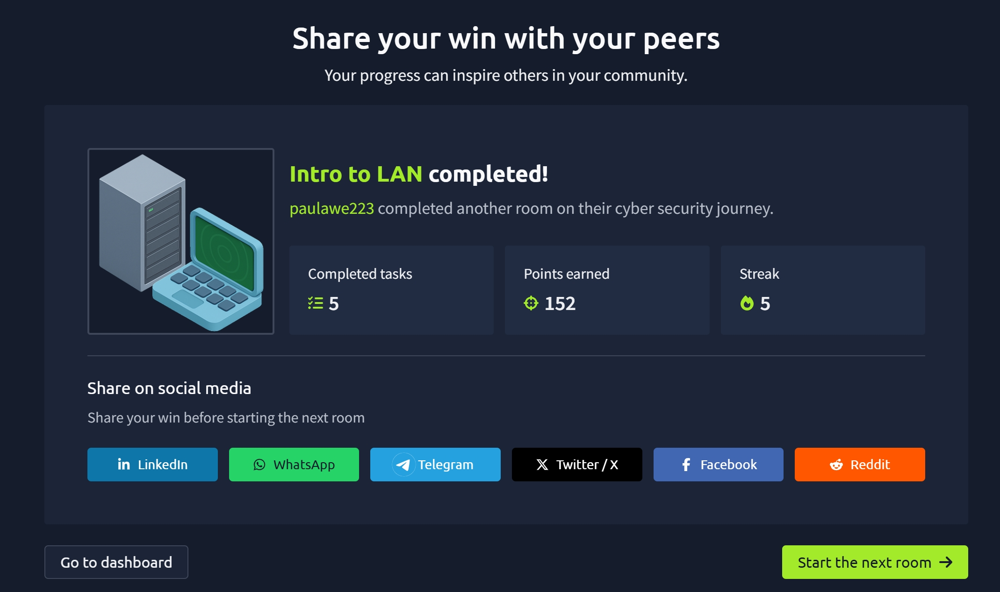

# TryHackMe — Intro to LAN

## 🧠 What I learned

### Network Topologies

#### Star Topology
- Uses a central device (like a switch or hub)
- Devices connect to this central device
- Reliable and scalable
- More expensive due to extra cabling and equipment

---

#### Bus Topology
- Uses a single backbone cable
- All devices share the same cable
- Cheap and easy to set up
- Can become slow due to traffic (bottleneck)
- Difficult to troubleshoot

---

#### Ring Topology
- Devices form a loop
- Data travels in one direction
- Each device passes data to the next
- Easier to troubleshoot
- If one device or cable fails, the whole network breaks

---

## 🔌 Networking Devices

### Switch
- Connects multiple devices in a network
- Sends data only to the intended device
- More efficient than hubs
- Uses ports (4, 8, 16, 24, etc.)

---

### Router
- Connects different networks
- Uses routing to send data between networks
- Determines the best path for data

---

## 🌐 Subnetting

- Splitting a network into smaller networks

### Benefits:
- Efficiency  
- Security  
- Better control  

### Key Terms:
- Network Address → identifies the network  
- Host Address → identifies a device  
- Default Gateway → connects to other networks  

---

## 🔄 ARP (Address Resolution Protocol)

- Maps IP address to MAC address  
- Devices store mappings in ARP cache  

### How it works:
1. ARP Request → broadcast asking for MAC  
2. ARP Reply → device responds with MAC  

---

## 📡 DHCP (Dynamic Host Configuration Protocol)

- Automatically assigns IP addresses  

### Process:
1. DHCP Discover  - sends out a request to see if any DHCP servers are on the network
2. DHCP Offer  - DHCP server then replies back with an IP address the device could use 
3. DHCP Request  - The device then sends a reply confirming it wants the offered IP Address 
4. DHCP ACK  - DHCP server sends a reply acknowledging this has been completed, and the device can start using the IP Address 

---

## 📸 Proof of Completion

---

## 📌 Notes

This module helped me understand:
- How networks are structured (topologies)
- How devices communicate (ARP, DHCP)
- How networks are organized (subnetting)
