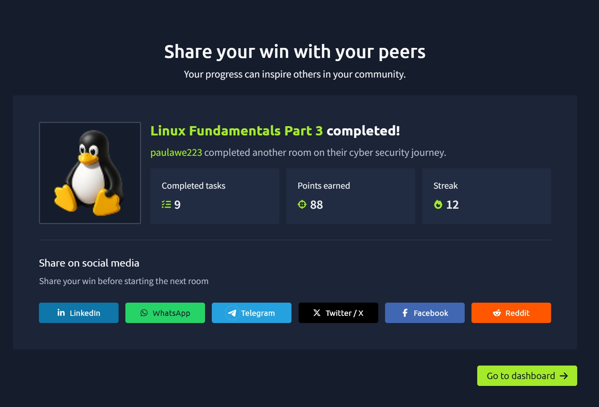

# TryHackMe — Linux Fundamentals Part 3

## 🧠 What I learned

### 📝 Terminal Text Editors

#### Nano
- Simple and beginner-friendly text editor
- Create or edit files using:
  nano filename
- Useful shortcuts (Ctrl key):
  - Ctrl + X → Exit
  - Search, copy, paste, jump to line

#### VIM
- Advanced text editor
- Features:
  - Customizable
  - Syntax highlighting
  - Works on most systems
- More powerful but harder to learn

---

## 🌐 Downloading Files (wget)

- Used to download files from the internet

Example:
wget https://example.com/file.txt

---

## 🔐 Transferring Files (SCP)

- Securely copy files between systems using SSH

### Copy from local to remote:
scp file.txt user@IP:/destination/path

### Copy from remote to local:
scp user@IP:/path/file.txt localfile.txt

---

## 🌍 Hosting Files (Python Web Server)

- Turn your machine into a web server:

python3 -m http.server

- Runs on port 8000 by default
- Can download files using wget from another machine

---

## ⚙️ Processes 101

- Processes = programs running on your system
- Each process has a PID (Process ID)

### View processes:
ps
ps aux

---

## 🛑 Managing Processes

- Kill processes using:
kill PID

### Signals:
- SIGTERM → Graceful stop
- SIGKILL → Force stop
- SIGSTOP → Pause process

---

## 🧠 How Processes Work

- Managed by the system using **namespaces**
- systemd is the main process (PID 0/1 depending on system)
- All processes are children of systemd

---

## 🚀 Managing Services (systemctl)

- Used to control services

Commands:
systemctl start service  
systemctl stop service  
systemctl enable service  
systemctl disable service  
systemctl status service  

---

## 🔄 Background & Foreground Processes

- Run in background:
command &

- Pause process:
Ctrl + Z

- Bring back to foreground:
fg

---

## ⏱️ Automation with Cron Jobs

- Used to schedule tasks automatically

Edit cron jobs:
crontab -e

### Format:
MIN HOUR DOM MON DOW CMD

Example (run every 12 hours):
0 */12 * * * cp -R /home/user/Documents /var/backups/

- `*` = wildcard (any value)

---

## 📸 Proof of Completion

---

## 📌 Notes

This room helped me understand:
- How to use Nano and VIM text editors
- Downloading and transferring files securely
- Hosting files using Python web server
- Managing processes and system services
- Background and foreground execution
- Automating tasks with cron jobs
