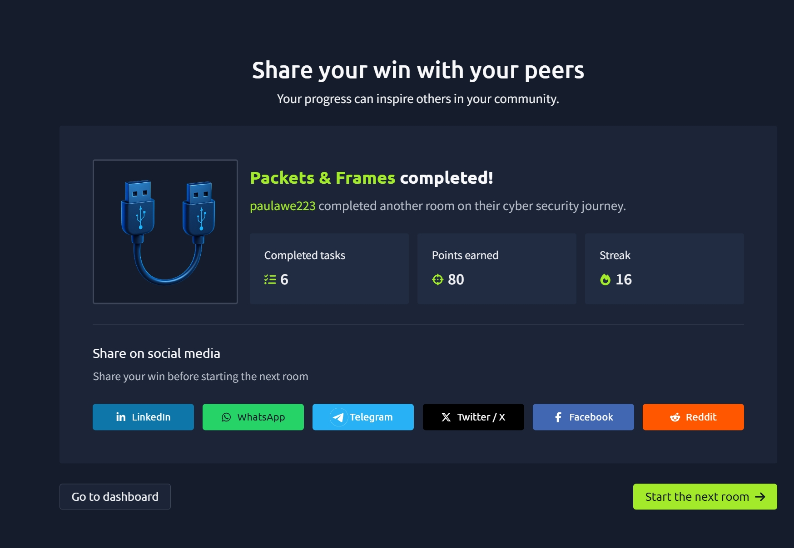

# TryHackMe — Packets & Frames

## 🧠 What I learned

### 📦 Packets vs Frames

- **Packets** → Layer 3 (Network Layer)
- **Frames** → Layer 2 (Data Link Layer)

- A **frame encapsulates a packet**
- This process is called **encapsulation**

💡 Analogy:
- Frame = Envelope  
- Packet = Letter inside  

---

## 🔄 Encapsulation

- Data is wrapped as it moves through layers
- Each layer adds extra information (headers)
- Reverse process = **Decapsulation**

---

## 📡 Packet Structure

Packets contain headers with important information:

- Time to Live (TTL) → Prevents infinite looping  
- Checksum → Ensures data integrity  
- Source IP → Where data is coming from  
- Destination IP → Where data is going  

---

## 🌐 TCP/IP Model

4 Layers:
- Application  
- Transport  
- Internet  
- Network Interface  

---

## 🔐 TCP (Transmission Control Protocol)

- **Connection-based**
- Ensures data is delivered correctly

### Advantages:
- Reliable  
- Maintains data order  
- Ensures integrity  

### Disadvantages:
- Slower  
- Requires stable connection  

---

## 🤝 Three-Way Handshake

Used to establish a connection:

1. SYN → Client starts connection  
2. SYN/ACK → Server responds  
3. ACK → Connection confirmed  

Then:
- DATA is transmitted  
- FIN closes connection  

---

## 🔢 TCP Key Headers

- Source Port  
- Destination Port  
- Source IP  
- Destination IP  
- Sequence Number  
- Acknowledgement Number  
- Checksum  
- Data  
- Flags  

---

## ⚡ UDP (User Datagram Protocol)

- **Connectionless (stateless)**
- Faster but less reliable

### Advantages:
- Very fast  
- No connection required  

### Disadvantages:
- No guarantee of delivery  
- No data integrity  

---

## 🔌 Ports 101

- Ports range: **0 – 65535**
- Used for communication between applications

### Common Ports:

| Protocol | Port | Description |
|---|---|---|
| FTP | 21 | File transfer |
| SSH | 22 | Secure login |
| HTTP | 80 | Web traffic |
| HTTPS | 443 | Secure web traffic |
| SMB | 445 | File/device sharing |
| RDP | 3389 | Remote desktop |

---

## 📌 Key Concept

- Data is sent in **small chunks (packets)**
- Reassembled at the destination
- Reduces network congestion and improves efficiency

---

## 📸 Proof of Completion

---

## 📌 Notes

This room helped me understand:
- The difference between packets and frames
- How encapsulation works in networking
- TCP vs UDP communication
- The TCP three-way handshake
- How ports control communication between devices
