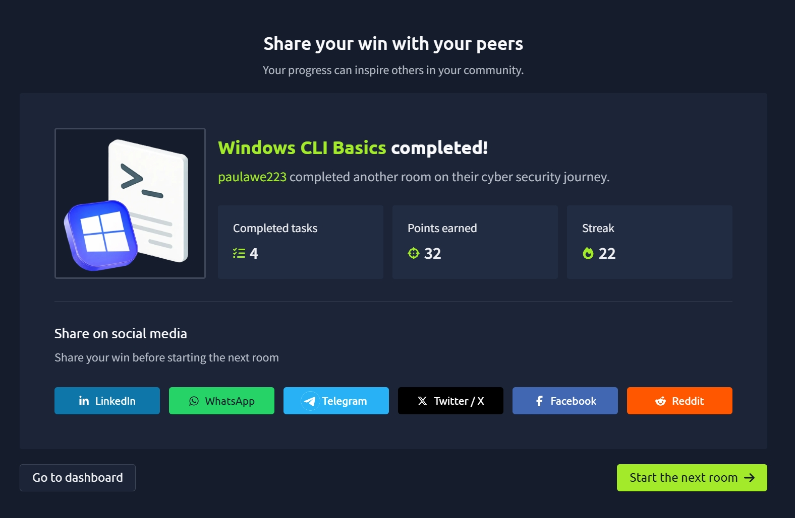

# TryHackMe Day 42–43: Windows CLI Basics

## Room Information

**Room:** Windows CLI Basics
**Platform:** TryHackMe
**Difficulty:** Beginner
**Focus Area:** Windows Command Line, File Navigation, System Information Gathering

---

## Overview

In this room, I learned how to interact with Windows systems using the Command Prompt (CMD). Instead of relying on the graphical user interface (GUI), I practiced using command-line tools to navigate directories, locate files, view file contents, and gather important system and network information.

These skills are essential in cybersecurity because many investigations, troubleshooting tasks, and administrative activities require working directly from the command line.

---

## Learning Objectives

By completing this room, I learned how to:

* Use the Windows Command Prompt effectively
* Navigate folders and directories
* Search for files using command-line tools
* View file contents directly in the terminal
* Gather basic system information
* Collect network configuration details
* Understand how Windows systems are organized

---

## Key Concepts Learned

### What is the Windows Command Line?

The Windows Command Prompt (CMD) is a text-based interface that allows users to interact directly with the operating system using commands.

Benefits include:

* Faster navigation and administration
* Greater control over the system
* Access to tools unavailable through the GUI
* Essential for troubleshooting and cybersecurity tasks

---

## Navigating the Windows File System

### Checking Current Location

The `cd` command can display the current directory.

```cmd
cd
```

Example output:

```cmd
C:\Users\Administrator
```

This helps identify where you are currently working within the file system.

---

### Listing Directory Contents

To display files and folders in the current directory:

```cmd
dir
```

This command shows:

* Files
* Directories
* Dates
* Sizes

---

### Viewing Hidden Files and Folders

Some Windows files and folders are hidden by default.

To display them:

```cmd
dir /a
```

This allows administrators and analysts to see hidden content that may otherwise be overlooked.

---

### Changing Directories

Move into a folder:

```cmd
cd Documents
```

Move back one directory:

```cmd
cd ..
```

These commands are fundamental when navigating through Windows systems.

---

## Finding Files from the Command Line

Instead of manually searching through folders, Windows can search recursively.

### Search for a File

```cmd
dir /s task_brief.txt
```

The `/s` switch tells Windows to search all subdirectories.

Benefits:

* Quickly locate files
* Useful during investigations
* Saves time when dealing with large systems

---

### Reading File Contents

Once a file is located, its contents can be displayed using:

```cmd
type task_brief.txt
```

This prints the file contents directly in the terminal.

---

## Gathering System Information

One of the most important skills in cybersecurity is understanding the system you're working on.

---

### Identify Current User

```cmd
whoami
```

Purpose:

* Displays the currently logged-in user
* Helps determine permissions and access levels

Example:

```cmd
administrator
```

---

### Identify the Computer Name

```cmd
hostname
```

Purpose:

* Displays the machine name
* Useful for network identification

Example:

```cmd
WIN-SERVER01
```

---

### View Detailed System Information

```cmd
systeminfo
```

Important details gathered:

* OS Name
* OS Version
* System Type
* Installed Updates
* System Manufacturer
* Memory Information

This command provides a quick overview of the system's configuration.

---

### View Network Configuration

```cmd
ipconfig
```

Important information includes:

* IPv4 Address
* Subnet Mask
* Default Gateway

This information helps determine how the system communicates on a network.

---

## Important Commands Learned

| Command           | Purpose                       |
| ----------------- | ----------------------------- |
| `cd`              | Display or change directories |
| `dir`             | List files and folders        |
| `dir /a`          | Show hidden files and folders |
| `dir /s filename` | Search for a file recursively |
| `type filename`   | Display file contents         |
| `whoami`          | Show current user             |
| `hostname`        | Show computer name            |
| `systeminfo`      | Display system information    |
| `ipconfig`        | Display network configuration |

---

## Key Takeaways

* The Windows Command Prompt provides direct interaction with the operating system.
* File navigation is performed using commands such as `cd` and `dir`.
* Hidden files can be revealed using `dir /a`.
* Files can be located efficiently using recursive searches.
* System information can be gathered using `whoami`, `hostname`, and `systeminfo`.
* Network details can be viewed using `ipconfig`.
* Command-line proficiency is a foundational cybersecurity skill.

---

## Skills Gained

* Windows Command Line Navigation
* File System Exploration
* File Searching Techniques
* System Enumeration
* Basic Network Enumeration
* Windows Administration Fundamentals
* Cybersecurity Investigation Fundamentals

---

## Completion Badge



---

## Reflection

This room helped me become more comfortable working in the Windows Command Prompt environment. I learned how to move around the file system, locate files efficiently, and gather important information about both the operating system and network configuration.

Understanding these commands is essential because many cybersecurity investigations begin with system enumeration and information gathering. The ability to quickly identify users, hosts, operating system details, and network settings provides a strong foundation for future blue-team, incident response, and system administration activities.

---

**Platform:** TryHackMe
**Room:** Windows CLI Basics
**Completed:** Day 42–43 of My Cybersecurity Learning Journey
