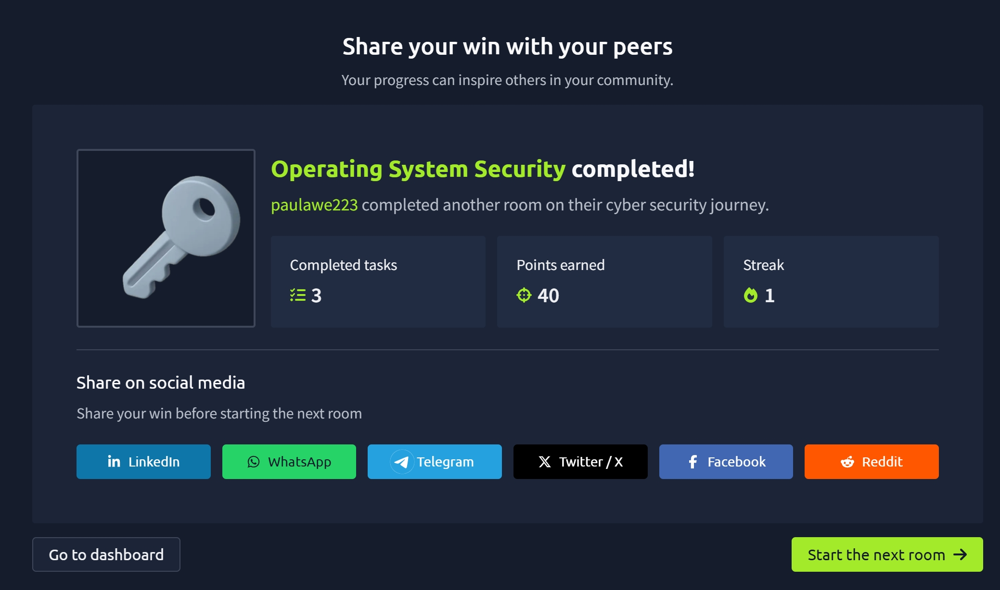

# TryHackMe Day 44–45: Operating System Security

## Room Information

**Room:** Operating System Security  
**Platform:** TryHackMe  
**Difficulty:** Beginner  
**Focus Area:** Operating System Security Fundamentals, CIA Triad, Authentication, File Permissions, Malware Awareness

---

## Overview

In this room, I learned the fundamental concepts of operating system security and why securing devices such as laptops, desktops, servers, and smartphones is essential. Every operating system manages hardware resources and allows applications to interact with the system safely, making it a critical component in cybersecurity.

The room introduced common security risks that affect operating systems and explained how attackers target weaknesses in authentication, file permissions, and software.

---

## Learning Objectives

By completing this room, I learned how to:

- Understand the role of an operating system
- Explain the relationship between hardware, operating systems, and applications
- Understand the CIA Triad (Confidentiality, Integrity, Availability)
- Recognize common operating system security weaknesses
- Identify risks associated with weak passwords
- Understand the principle of least privilege
- Learn how malicious software impacts system security

---

## What is an Operating System?

An Operating System (OS) acts as the layer between computer hardware and software applications.

Examples of operating systems include:

### Desktop Operating Systems

- Windows 11
- macOS
- Linux
- Chrome OS

### Mobile Operating Systems

- Android
- iOS

### Server Operating Systems

- Windows Server
- Linux
- Oracle Solaris
- IBM AIX

Without an operating system, applications cannot communicate directly with computer hardware.

---

## Why Operating System Security Matters

Modern devices contain sensitive information such as:

- Personal photographs
- Private conversations
- Email accounts
- Banking applications
- Saved passwords
- Work documents
- Educational records
- Identity documents

Protecting this information is one of the primary goals of cybersecurity.

---

## The CIA Triad

A core security concept introduced in this room is the CIA Triad.

### Confidentiality

Confidentiality ensures that information is accessible only to authorized individuals.

Examples:

- Personal files
- Financial records
- Company documents
- Private communications

---

### Integrity

Integrity ensures that information cannot be modified without authorization.

Examples:

- Preventing unauthorized edits to files
- Protecting databases from tampering
- Maintaining accurate records

---

### Availability

Availability ensures that systems and data remain accessible when needed.

Examples:

- Accessible websites
- Functional operating systems
- Available business applications

---

## Common Operating System Security Weaknesses

The room focused on three major security weaknesses commonly targeted by attackers.

### 1. Authentication and Weak Passwords

Authentication is the process of verifying identity before granting access.

Common authentication factors include:

#### Something You Know

- Password
- PIN

#### Something You Are

- Fingerprint
- Facial recognition

#### Something You Have

- Mobile phone
- Security token

---

### Risks of Weak Passwords

Many users choose predictable passwords such as:

- 123456
- password
- qwerty
- abc123
- password1

Attackers commonly use password dictionaries containing thousands of frequently used passwords to compromise accounts.

### Best Practices

- Use strong passwords
- Use unique passwords for each account
- Avoid personal information
- Consider password managers
- Enable Multi-Factor Authentication (MFA)

---

## 2. Weak File Permissions

File permissions determine who can:

- Read files
- Modify files
- Delete files
- Execute programs

Weak permissions can expose sensitive data and allow unauthorized modifications.

---

### Principle of Least Privilege

The Principle of Least Privilege means users should only receive the minimum permissions required to perform their tasks.

Benefits include:

- Reduced attack surface
- Better confidentiality
- Improved integrity
- Lower risk of accidental damage

---

## 3. Malicious Programs

Malware is software designed to harm systems, steal information, or disrupt operations.

Examples include:

### Trojan Horses

Trojans can:

- Grant attackers remote access
- Steal information
- Modify files

---

### Ransomware

Ransomware:

- Encrypts files
- Makes data inaccessible
- Demands payment for decryption

This primarily impacts availability but may also threaten confidentiality and integrity.

---

## Key Security Concepts Learned

| Concept | Description |
|----------|-------------|
| Operating System | Software layer between hardware and applications |
| Confidentiality | Protecting data from unauthorized access |
| Integrity | Protecting data from unauthorized modification |
| Availability | Ensuring systems remain accessible |
| Authentication | Verifying user identity |
| Least Privilege | Granting only necessary permissions |
| Malware | Software designed to cause harm |
| Ransomware | Malware that encrypts files for ransom |

---

## Skills Gained

- Operating System Security Fundamentals
- CIA Triad Understanding
- Authentication Concepts
- Password Security Awareness
- File Permission Security
- Principle of Least Privilege
- Malware Identification
- Cybersecurity Risk Awareness

---

## Key Takeaways

- Operating systems play a critical role in cybersecurity.
- The CIA Triad forms the foundation of information security.
- Weak passwords remain one of the most common attack vectors.
- Proper file permissions help protect confidentiality and integrity.
- The Principle of Least Privilege reduces security risks.
- Malware can impact confidentiality, integrity, and availability.
- Strong authentication practices are essential for protecting systems and data.

---

## Completion Badge

---

## Reflection

This room introduced me to some of the most important foundational concepts in cybersecurity. I learned how operating systems serve as the bridge between hardware and software, why protecting data is critical, and how attackers exploit weak passwords, excessive permissions, and malicious software.

Understanding the CIA Triad and the Principle of Least Privilege has given me a stronger appreciation for how security professionals design and maintain secure systems. These concepts provide the foundation for many advanced cybersecurity topics that I will encounter later in my learning journey.

---

**Platform:** TryHackMe  
**Room:** Operating System Security  
**Completed:** Day 44–45 of My Cybersecurity Learning Journey
