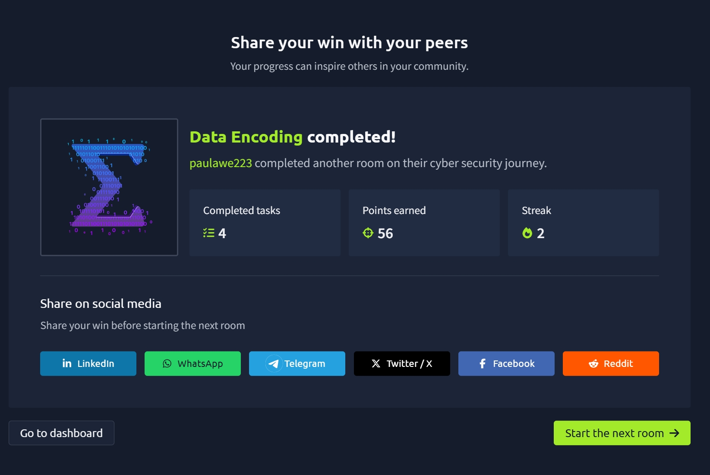

# TryHackMe Day 48–49: Data Encoding

## Overview

In this room, I learned how computers store and represent text using different encoding standards. Since computers only understand binary data, every letter, number, symbol, and emoji must be converted into numerical values before they can be stored or displayed.

The room explored the evolution of character encoding from ASCII to Unicode and explained how modern systems represent text from multiple languages while maintaining compatibility across different platforms.

---

## Key Concepts Learned

### 1. What is Data Encoding?

Data encoding is the process of assigning numeric values to characters so computers can store and process text.

Examples:

- A
- B
- 5
- !
- 😊

All of these characters are represented internally as numbers.

Without encoding standards, computers would not know how to interpret stored binary data as readable text.

---

### 2. ASCII (American Standard Code for Information Interchange)

ASCII was one of the earliest text encoding standards.

Key facts:

- Introduced in 1963
- Uses 7 bits
- Supports 128 characters
- Covers English letters, numbers, punctuation, and control characters

Examples:

| Character | Decimal | Hex |
|------------|----------|-----|
| A | 65 | 41 |
| B | 66 | 42 |
| a | 97 | 61 |
| 0 | 48 | 30 |
| 9 | 57 | 39 |

ASCII allowed computers to store text consistently by assigning each character a unique numeric value.

---

### 3. How Text is Stored

The room demonstrated how the word:

```
TryHackMe
```

can be represented as binary values.

Example:

```
T = 01010100
r = 01110010
y = 01111001
```

Computers store text as a sequence of binary values and later convert those values back into readable characters.

---

### 4. Limitations of ASCII

ASCII works well for English but lacks support for many international characters.

Examples:

- ñ
- ü
- ł
- č
- ș

To support additional languages, extended standards such as:

- ISO-8859-1 (Latin-1)
- ISO-8859-2 (Latin-2)

were introduced.

However, using different encoding standards often caused characters to display incorrectly.

---

### 5. Why Gibberish Characters Appear

One of the most interesting lessons was understanding why text sometimes appears as random symbols or unreadable characters.

This usually happens when:

- A file is saved using one encoding
- It is opened using a different encoding

Because the numeric values are interpreted differently, the displayed characters become corrupted.

---

### 6. Unicode

Unicode was created to solve the limitations of older encoding standards.

Unicode provides:

- A universal character set
- Support for virtually every language
- Support for symbols and emojis
- Consistent representation across platforms

Examples:

| Character | Unicode |
|------------|----------|
| A | U+0041 |
| Ω | U+03A9 |
| あ | U+3042 |
| 😊 | U+1F60A |

Unicode allows multiple languages to exist within the same document without compatibility issues.

---

### 7. UTF-8, UTF-16 and UTF-32

Unicode characters must still be stored in memory.

The room introduced three common Unicode encoding methods.

#### UTF-8

- Uses 1–4 bytes
- Most common on the modern web
- Backward compatible with ASCII
- Efficient storage

#### UTF-16

- Uses 2 or 4 bytes
- Common in Windows and Java environments

#### UTF-32

- Always uses 4 bytes
- Simplest representation
- Uses the most storage space

---

### 8. Emoji and Special Character Encoding

Modern encoding standards support emojis and special symbols.

Examples:

| Character | Unicode |
|------------|----------|
| 😊 | U+1F60A |
| 🔥 | U+1F525 |
| ♞ | U+265E |
| 龍 | U+9F8D |
| ツ | U+30C4 |

This demonstrates how Unicode can represent content far beyond traditional alphabets.

---

## What I Learned

Through this room, I learned:

- How computers represent text using numbers
- The purpose of ASCII encoding
- Why ASCII became insufficient for global languages
- How Unicode solved international character support problems
- Differences between UTF-8, UTF-16, and UTF-32
- How emojis are stored and displayed
- Why encoding mismatches create unreadable text

---

## Skills Gained

- Character Encoding Fundamentals
- ASCII Encoding
- Unicode Standards
- UTF-8 / UTF-16 / UTF-32
- Binary Representation of Text
- Troubleshooting Encoding Issues
- Data Representation Concepts

---

## Completion Badge



Successfully completed the **Data Encoding** room on TryHackMe as part of my cybersecurity learning journey.

---

### Repository Structure

```text
tryhackme-labs/
└── tryhackme-day-48-49-data-encoding.md

assets/
└── data-encoding.jpg
```
