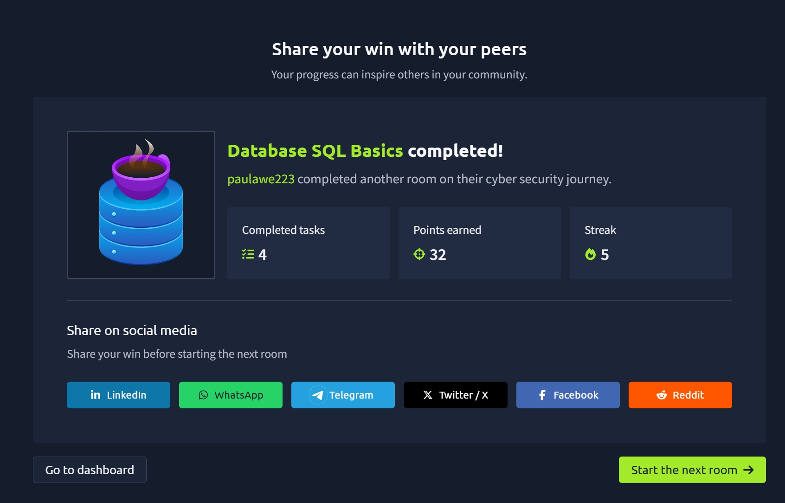

# TryHackMe Day 54–55: Database SQL Basics

## Introduction

Today I completed the **Database SQL Basics** room on TryHackMe. This room introduced the fundamentals of databases and SQL (Structured Query Language), showing how data is stored, organized, and retrieved efficiently.

Using a simple café example, I learned how businesses can use databases instead of paper records to manage large amounts of information and quickly answer questions about their data.

---

## Learning Objectives

During this room, I learned how to:

* Understand what data is and why it is important.
* Explain what a database is and why organizations use databases.
* Understand the purpose of SQL.
* Identify tables, rows, and columns.
* Write basic SQL queries to retrieve, filter, and sort data.

---

# What is a Database?

A **database** is an organized collection of data that allows information to be stored, searched, updated, and managed efficiently.

Instead of searching through paper records manually, databases allow computers to retrieve information in seconds.

Example:

A café stores customer orders in a database instead of a notebook. This makes it easy to answer questions like:

* How many coffees were sold today?
* What is the cheapest drink?
* Which drinks cost more than $3?

---

# Tables, Rows, and Columns

A database organizes information into **tables**.

Each table contains:

### Columns

Columns describe the type of information being stored.

Example:

* ID
* Drink
* Price
* Time

### Rows

Each row represents one complete record.

Example:

| ID | Drink  | Price | Time  |
| -- | ------ | ----- | ----- |
| 1  | Coffee | $2.20 | 09:20 |

One row contains all information about a single order.

---

# What is SQL?

SQL (**Structured Query Language**) is the language used to communicate with databases.

Instead of searching through data manually, SQL allows us to ask questions and retrieve exactly the information we need.

These requests are called **queries**.

---

# SQL Queries Learned

## SELECT

The `SELECT` statement specifies which data you want to display.

Example:

```sql
SELECT * FROM Orders;
```

The `*` means "show every column."

---

## Selecting Specific Columns

Instead of displaying everything, you can select only certain columns.

Example:

```sql
SELECT drink, price
FROM Orders;
```

This displays only the drink names and prices.

---

## WHERE

The `WHERE` clause filters records based on a condition.

Example:

```sql
SELECT *
FROM Orders
WHERE drink = 'Coffee';
```

Only coffee orders are returned.

---

## ORDER BY

The `ORDER BY` clause sorts the results.

Ascending order:

```sql
SELECT *
FROM Orders
ORDER BY price;
```

Descending order:

```sql
SELECT *
FROM Orders
ORDER BY price DESC;
```

`DESC` sorts from highest to lowest.

---

## Combining WHERE and ORDER BY

SQL statements can be combined.

Example:

```sql
SELECT *
FROM Orders
WHERE drink = 'Coffee'
ORDER BY price DESC;
```

This returns only coffee orders, sorted from the highest price to the lowest.

---

# Key Concepts Learned

* Databases store information in an organized format.
* Tables organize data into rows and columns.
* Each row represents one complete record.
* Each column stores one type of information.
* SQL is used to communicate with databases.
* Queries retrieve information without changing the stored data.
* Data can be filtered using `WHERE`.
* Results can be sorted using `ORDER BY`.
* SQL makes finding information much faster than searching manually.

---

# Skills Gained

* Database fundamentals
* Understanding tables, rows, and columns
* Writing basic SQL queries
* Retrieving data with `SELECT`
* Filtering results using `WHERE`
* Sorting results using `ORDER BY`
* Combining SQL clauses to answer specific questions
* Understanding how businesses use databases to manage information

---

# Why This Matters for Cybersecurity

Understanding databases is an essential cybersecurity skill because security analysts frequently investigate stored data during incident response and threat hunting.

Examples include:

* Searching authentication logs
* Investigating suspicious user activity
* Reviewing login histories
* Finding compromised accounts
* Examining audit records
* Querying security event databases
* Supporting forensic investigations

Many Security Operations Centers (SOCs) use SQL to investigate alerts, analyze logs, and identify suspicious behavior, making SQL knowledge valuable for cybersecurity professionals.

---

## Room Completed ✅



---

## Key Takeaways

* Databases organize information efficiently.
* Tables consist of rows and columns.
* SQL is the standard language for querying databases.
* `SELECT` retrieves data.
* `WHERE` filters records.
* `ORDER BY` sorts results.
* SQL is widely used in cybersecurity for investigations, log analysis, and threat detection.

---

**Day 54–55 Complete ✔️**

On to the next room in my TryHackMe cybersecurity journey!
