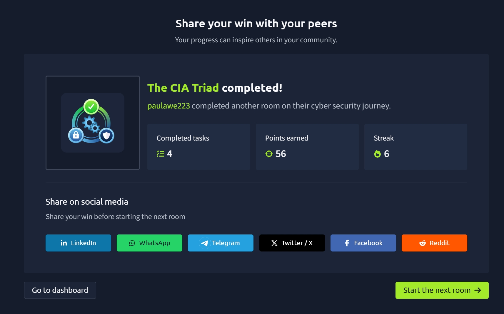

# TryHackMe Day 56–57: The CIA Triad

## Overview

Today I completed the **The CIA Triad** room on TryHackMe. This room introduced one of the most fundamental concepts in cybersecurity: the **CIA Triad**, which defines the three primary objectives of protecting digital information.

Rather than focusing on specific attacks or security tools, this room explains **what cybersecurity is actually trying to protect**. Understanding these three principles provides the foundation for nearly every area of cybersecurity.

---

## Learning Objectives

By completing this room, I learned how to:

* Understand the three pillars of cybersecurity
* Explain the purpose of Confidentiality, Integrity, and Availability
* Recognize real-world examples of each principle
* Make decisions that preserve the security of digital information

---

# What is the CIA Triad?

The CIA Triad is a security model consisting of three essential principles:

* **Confidentiality**
* **Integrity**
* **Availability**

Every cybersecurity professional works to protect these three aspects of digital information.

---

# 1. Confidentiality

**Definition:**
Confidentiality ensures that sensitive information is only accessible to authorized individuals.

If unauthorized people gain access to confidential information, it can result in:

* Privacy violations
* Financial loss
* Identity theft
* Legal consequences

### Examples

✅ Employees can access only the documents required for their jobs.

❌ Personal documents accidentally published online.

❌ Passwords written on sticky notes for everyone to see.

### Common Security Controls

* Encryption
* Access Control
* Authentication
* Multi-Factor Authentication (MFA)

---

# 2. Integrity

**Definition:**
Integrity ensures that information cannot be modified without authorization.

Data should remain:

* Accurate
* Complete
* Trustworthy

Unauthorized changes may lead to serious consequences.

### Examples

✅ Data updated through an authorized approval process.

❌ Student grades changed after final submission.

❌ Bank transaction details altered before completion.

### Common Security Controls

* Hashing
* Digital Signatures
* Version Control
* File Integrity Monitoring

---

# 3. Availability

**Definition:**
Availability ensures that systems, applications, and data remain accessible whenever authorized users need them.

Even if data is secure, it has little value if legitimate users cannot access it.

### Examples

✅ Employees can access company systems during business hours.

❌ Company website becomes unavailable during working hours.

❌ Critical business services stop after a software installation.

### Common Security Controls

* Backups
* Redundant Systems
* Load Balancing
* Disaster Recovery Planning

---

# Why the CIA Triad Matters

Every cybersecurity decision ultimately supports one or more of these three principles.

For example:

* Encrypting sensitive files protects **Confidentiality**
* Preventing unauthorized changes protects **Integrity**
* Keeping services online protects **Availability**

Understanding the CIA Triad helps build the cybersecurity mindset needed for more advanced topics such as risk management, incident response, penetration testing, and security auditing.

---

# Key Takeaways

* Cybersecurity is about protecting information, not just stopping hackers.
* Confidentiality prevents unauthorized access.
* Integrity prevents unauthorized modification.
* Availability ensures systems remain accessible.
* The CIA Triad forms the foundation for nearly every cybersecurity concept.

---

## Skills Gained

* Cybersecurity Fundamentals
* CIA Triad
* Information Security
* Confidentiality
* Integrity
* Availability
* Risk Awareness
* Security Mindset
* Data Protection

---

## Room Completed

I successfully completed the **The CIA Triad** room on TryHackMe as part of my cybersecurity learning journey.

**Completion Badge**

---

## What's Next?

Next, I'll continue building my cybersecurity foundation by learning more about authentication, access control, common threats, and defensive security concepts.

---
