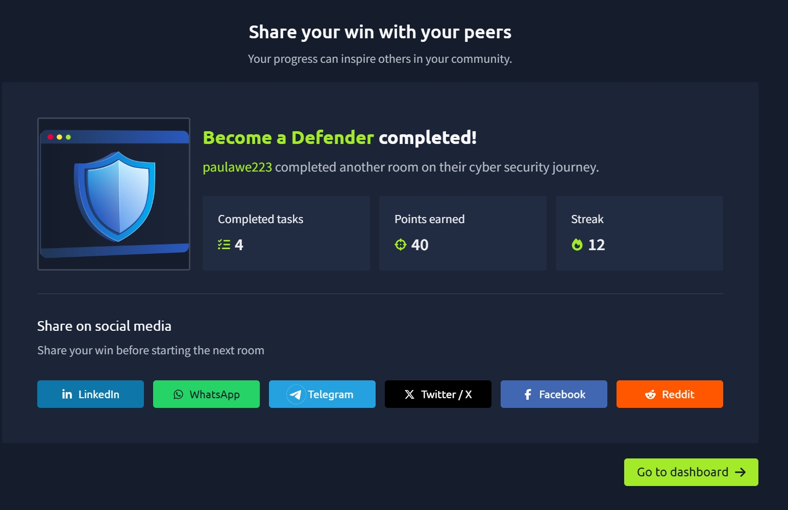

# TryHackMe Day 62–63: Become a Defender

## 🧠 What I Learned

In this room, I learned the fundamentals of defensive security and the responsibilities of cybersecurity defenders (Blue Team). While the previous room focused on attacking systems ethically, this room focused on protecting them by understanding infrastructure, identifying risks, monitoring activity, and responding to threats.

One of the biggest lessons I learned is that defenders must understand how attackers think in order to build stronger defenses. Security isn't just about installing antivirus software—it involves continuously monitoring systems, anticipating attacks, and improving security controls.

---

## What is Defensive Security?

Defensive Security focuses on protecting systems, networks, and data from cyber threats.

The primary objectives are to:

- Prevent attacks
- Detect suspicious activity
- Minimize the impact of security incidents
- Keep systems available and secure

Defenders are often referred to as the **Blue Team** because their job is to monitor, protect, and respond to threats across an organization's environment.

---

## Understanding the Environment

Before protecting an organization, defenders need to understand what exists within the environment.

This includes identifying:

- Employee devices
- Servers
- Email systems
- Firewalls
- Network infrastructure
- Internet-facing services

Without visibility, it's impossible to know what needs protection or detect when something goes wrong.

---

## The City Analogy

The room used a city analogy to explain defensive security.

| City | Infrastructure |
|------|----------------|
| Homes | Employee Devices |
| Shops/Public Buildings | Web Servers |
| Post Office | Mail Server |
| City Gate | Firewall |
| Outside the City | Internet |

This analogy helped me understand how every system within an organization has a specific role and requires different security controls.

---

## Core Defensive Security Concepts

I learned that defenders organize their work around five key concepts.

### Prevention

Stopping attacks before they happen.

Examples include:

- Firewalls
- Antivirus
- Software updates
- Security policies

---

### Detection

Monitoring systems to identify suspicious behavior.

Examples include:

- Security alerts
- Event logs
- Network monitoring
- Threat detection tools

---

### Mitigation

Reducing the damage during an attack.

Examples include:

- Blocking malicious IP addresses
- Disabling compromised accounts
- Isolating infected devices

---

### Analysis

Investigating incidents to determine:

- What happened
- How it happened
- Which systems were affected

Analysis helps organizations understand attacks and improve future defenses.

---

### Response and Improvement

After an incident, defenders recover affected systems and strengthen security to prevent similar attacks in the future.

Security is an ongoing process rather than a one-time task.

---

## The Defender Mindset

One of the most valuable lessons in this room was learning how defenders think.

Instead of simply protecting individual systems, defenders must understand how attackers move through an environment.

For example:

1. A phishing email infects a workstation.
2. Credentials are stolen.
3. The attacker accesses the mail server.
4. Sensitive company data becomes exposed.

Understanding these attack paths helps defenders stop attacks before they spread.

---

## Important Defender Principles

I learned several principles that guide defensive security:

- Anticipate potential threats.
- Understand common attack techniques.
- Prioritize high-value assets.
- Continuously improve security controls.

Cybersecurity is constantly evolving, so defenders must adapt to new threats and vulnerabilities.

---

## Security Controls

Different systems require different protection methods.

### Employee Devices

- Antivirus software
- Regular software updates

### Web Servers

- Secure communication
- Allow only trusted traffic

### Mail Servers

- Spam filtering
- Attachment scanning

### Firewalls

- Access control rules
- Block known malicious traffic

### Internet-Facing Services

- Restrict inbound connections
- Monitor for suspicious activity

Layering these defenses makes it much harder for attackers to compromise systems.

---

## Key Terminology

Some important defensive security terms I learned include:

- Blue Team
- Client Infrastructure
- Visibility
- Threat
- Prevention
- Detection
- Mitigation
- Risk

These concepts form the foundation of defensive cybersecurity.

---

## Career Paths

The room introduced several defensive security careers:

- Security Operations Center (SOC) Analyst
- Threat Intelligence Analyst
- Digital Forensics & Incident Response (DFIR)

It also recommended continuing with:

- Cyber Security 101
- SOC Level 1
- Jr Penetration Tester

---

## Key Takeaways

From this room I learned that:

- Defensive security focuses on protecting systems instead of attacking them.
- Visibility is essential for effective security monitoring.
- Security involves prevention, detection, mitigation, analysis, and response.
- Defenders must understand attacker behavior to build effective defenses.
- Layered security controls provide stronger protection than relying on a single tool.
- Cybersecurity is a continuous process that requires constant monitoring and improvement.

This room gave me a solid introduction to Blue Team responsibilities and helped me understand how organizations defend their infrastructure against real-world cyber threats.

---

## 📸 Proof of Completion

