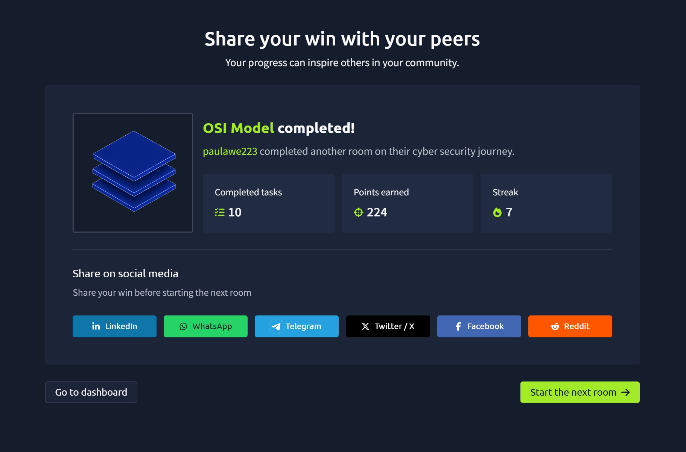

# TryHackMe — OSI Model

## 🧠 What I learned

The OSI (Open Systems Interconnection) Model is a framework that explains how devices communicate over a network.

It has 7 layers:

1. Physical  
2. Data Link  
3. Network  
4. Transport  
5. Session  
6. Presentation  
7. Application  

---

## 🔄 Encapsulation

- As data moves through each layer, information is added  
- This process is called **encapsulation**

---

## 📡 Layer 1 — Physical

- Deals with hardware (cables, signals)
- Data is transmitted as binary (1s and 0s)
- Example: Ethernet cables

---

## 🔌 Layer 2 — Data Link

- Handles physical addressing (MAC address)
- Uses NIC (Network Interface Card)
- Adds MAC address to data

- MAC address:
  - Unique to each device
  - Assigned by manufacturer
  - Can be spoofed

---

## 🌐 Layer 3 — Network

- Handles IP addressing and routing
- Determines best path for data

Examples of routing protocols:
- OSPF  
- RIP  

Factors for choosing path:
- Shortest path  
- Reliability  
- Speed of connection  

---

## 🚚 Layer 4 — Transport

- Responsible for data transmission

### TCP (Reliable)
- Ensures data arrives correctly
- Uses error checking
- Slower but accurate

### UDP (Fast)
- No guarantee of delivery
- Faster but less reliable

---

## 🔗 Layer 5 — Session

- Creates and maintains connection between devices
- Closes inactive sessions
- Uses checkpoints to resume data transfer

---

## 🔐 Layer 6 — Presentation

- Translates data between systems
- Ensures data format compatibility
- Handles encryption (e.g., HTTPS)

---

## 💻 Layer 7 — Application

- Closest layer to the user
- Provides interface for applications

Examples:
- Web browsers  
- Email clients  
- DNS  

---

## 📸 Proof of Completion

---

## 📌 Notes

This module helped me understand:
- How data moves through layers
- The difference between TCP and UDP
- How devices communicate across networks
