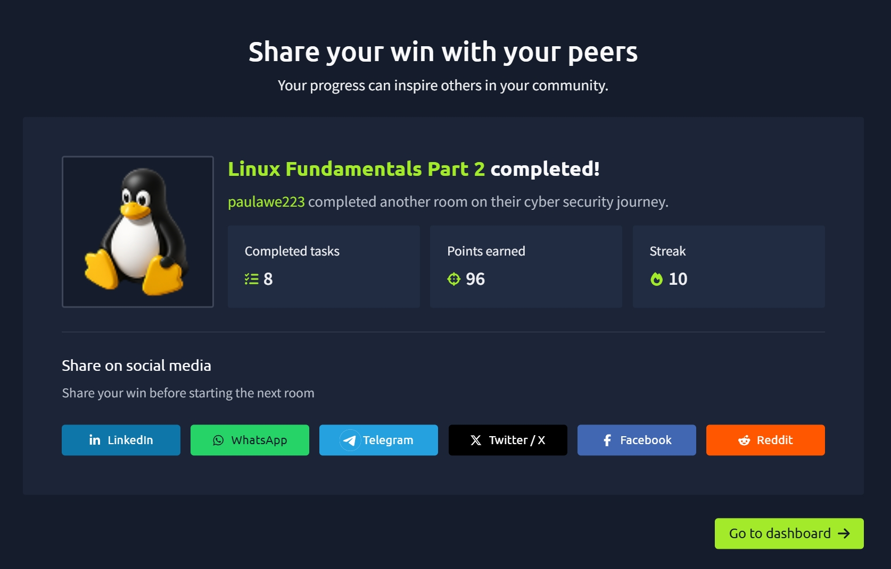

# TryHackMe — Linux Fundamentals Part 2

## 🧠 What I learned

### 🔐 What is SSH?

- SSH (Secure Shell) is a protocol used to communicate securely between devices over a network
- It encrypts data before sending it and decrypts it on the receiving machine
- This ensures secure remote access

#### Example usage:

ssh username@IP_address

🚪 Logging into a Remote Machine

To connect using SSH, you need:
- IP address of the remote machine
- Valid username and password

Example:

ssh tryhackme@10.114.191.66

⚙️ Flags and Switches
Many Linux commands support flags (arguments starting with -)
They modify how commands behave

Example:

ls -a
Lists all files including hidden ones

To see all available options:

ls --help

📖 Man Pages (Manual)
Used to read documentation for commands

Example:

man ls
Provides: Description, Available options, Usage examples

📁 File System Commands

| Command | Purpose              |
| ------- | -------------------- |
| `touch` | Create a file        |
| `mkdir` | Create a directory   |
| `cp`    | Copy files/folders   |
| `mv`    | Move files/folders   |
| `rm`    | Remove files/folders |
| `file`  | Identify file type   |

🔑 Permissions 101

Files and folders have 3 main permissions:

Read (r)
Write (w)
Execute (x)

🔢 Numeric Permissions

| Permission  | Value |
| ----------- | ----- |
| Read (r)    | 4     |
| Write (w)   | 2     |
| Execute (x) | 1     |

Example:
rwxrwxrwx = 777

Common examples:

| Symbolic  | Numeric | Meaning                           |
| --------- | ------- | --------------------------------- |
| rwxr-xr-x | 755     | Owner full, others read & execute |
| rw-r--r-- | 644     | Owner read/write, others read     |
| rwx------ | 700     | Only owner has access             |

Example command:
chmod 750 file.txt

🔄 Switching Users
Use su to switch users

Example:
su username
Use -l for full login environment:
su -l username

📂 Important Directories

| Directory | Description                            |
| --------- | -------------------------------------- |
| `/etc`    | System configuration files             |
| `/var`    | Logs and variable data                 |
| `/root`   | Root user’s home directory             |
| `/tmp`    | Temporary files (cleared after reboot) |

💡 /tmp is useful because:
Any user can write to it
Commonly used in penetration testing

## 📸 Proof of Completion

📌 Notes

This room helped me understand:

How SSH works and how to connect to remote machines
How to use flags and command documentation
File system manipulation commands
Linux permissions and their numeric values
Switching users and managing access
Important Linux directories and their purposes
