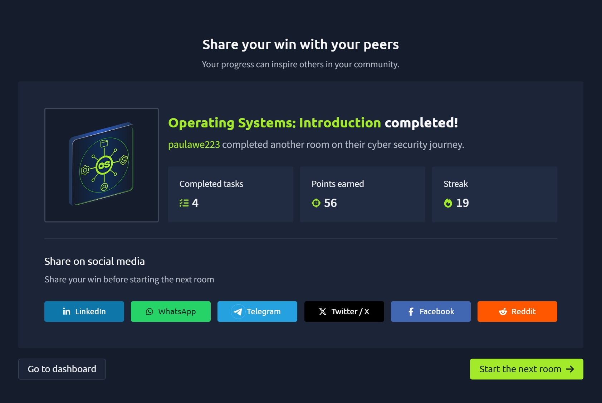

# TryHackMe: Operating Systems: Introduction

## Room Overview

The **Operating Systems: Introduction** room provided a foundational understanding of operating systems and their role in managing computer hardware, software, and system resources. The room explored the relationship between the kernel and user space while introducing essential Windows and Linux command-line concepts used by IT professionals, system administrators, and cybersecurity analysts.

Through practical exercises, I learned how to navigate file systems, locate files, gather system information, identify users, and inspect network configurations using common command-line tools.

---

## Tasks Completed

* Understanding the role of an Operating System (OS)
* Learning the difference between Kernel Space and User Space
* Exploring Windows command-line basics
* Navigating directories and files using CLI commands
* Searching for files and reading file contents
* Gathering user, host, and operating system information
* Viewing network configuration details

---

## Key Concepts Learned

### Operating System (OS)

An Operating System is the core software that manages communication between users, applications, and hardware components. It acts as the central coordinator that ensures all system processes run efficiently.

### Kernel Space

Kernel Space is the privileged area of the operating system where the kernel operates.

Responsibilities include:

* Managing CPU resources
* Managing memory allocation
* Handling storage devices
* Controlling hardware access
* Managing system-level operations

The kernel has unrestricted access to all hardware resources.

### User Space

User Space is where applications and user programs run.

Applications cannot directly access hardware resources. Instead, they use **system calls** to request services from the kernel.

Examples:

* Opening files
* Playing audio
* Connecting to Wi-Fi
* Accessing storage devices

This separation improves system stability and security.

---

## Windows Command-Line Basics

### Check Current Directory

```cmd
cd
```

Displays the current working directory.

### List Directory Contents

```cmd
dir
```

Shows files and folders in the current directory.

### View Hidden Files

```cmd
dir /a
```

Displays all files, including hidden and system files.

### Change Directory

```cmd
cd folder_name
```

Moves into a specified folder.

### Move Back One Directory

```cmd
cd ..
```

Returns to the parent directory.

### Search for a File

```cmd
dir /s filename
```

Searches all subdirectories and displays the full path of the specified file.

### Read a File

```cmd
type filename
```

Displays the contents of a file directly in the Command Prompt.

---

## System Information Gathering

### Identify Current User

```cmd
whoami
```

Displays the username of the currently logged-in account.

This is useful for:

* Permission verification
* Privilege assessment
* Security investigations

### Identify Computer Name

```cmd
hostname
```

Displays the system's hostname.

This is commonly used for:

* Network administration
* Asset identification
* Troubleshooting

### View Operating System Information

```cmd
systeminfo
```

Provides detailed information about:

* Windows version
* System architecture
* Installed updates
* Memory details
* Boot time

### View Network Configuration

```cmd
ipconfig
```

Displays network settings including:

* IP Address
* Subnet Mask
* Default Gateway
* Network Adapter Information

This command is frequently used during network troubleshooting and incident response.

---

## Why This Matters in Cybersecurity

Understanding operating systems is fundamental for cybersecurity professionals because nearly every security assessment, investigation, or troubleshooting task requires interaction with the operating system.

Key cybersecurity applications include:

* User account enumeration
* Privilege assessment
* System auditing
* Network troubleshooting
* Incident response
* Malware analysis
* System hardening

Strong OS knowledge provides the foundation needed for both defensive and offensive security roles.

---

## Practical Skills Gained

* Understanding operating system architecture
* Differentiating between kernel space and user space
* Navigating Windows file systems
* Searching for files using command-line tools
* Gathering system information
* Identifying users and hostnames
* Viewing network configurations
* Building familiarity with Windows CLI operations

---

## Screenshot



---

## Reflection

This room strengthened my understanding of how operating systems function behind the scenes and how users, applications, and hardware interact through the kernel. I gained hands-on experience using common Windows command-line tools for file navigation, system information gathering, and network troubleshooting. These skills form an essential foundation for future cybersecurity tasks such as system administration, incident response, penetration testing, and security analysis.

---

**Platform:** TryHackMe
**Room:** Operating Systems: Introduction
**Completed:** Day 18–19 of My Cybersecurity Learning Journey
