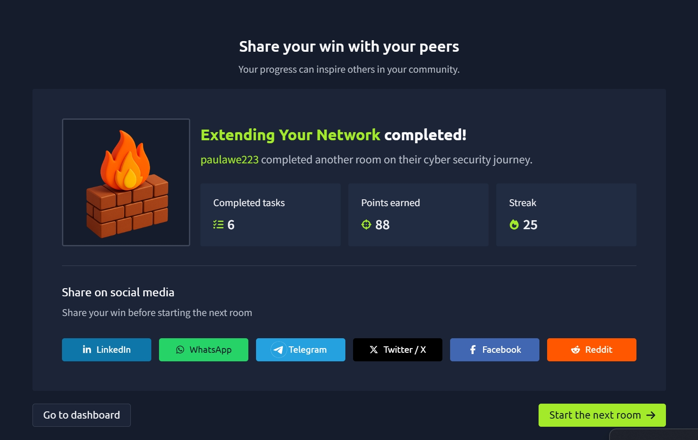

# TryHackMe: Extending Your Network

## Room Overview

The **Extending Your Network** room introduced key networking technologies that allow networks to communicate securely and efficiently across larger environments. I learned how services are exposed to the Internet through port forwarding, how firewalls protect networks, how VPNs create secure tunnels between devices, and the role of networking devices such as routers and switches.

The room also covered VLANs, which are used to logically separate devices within the same physical network to improve security and network management.

---

## Tasks Completed

* Understanding Port Forwarding
* Learning Firewall Fundamentals
* Exploring VPN Technology
* Understanding Router Functionality
* Learning the Difference Between Layer 2 and Layer 3 Switches
* Understanding VLAN Segmentation

---

## Key Concepts Learned

### Port Forwarding

Port forwarding allows services hosted on a private network to be accessible from the Internet.

Without port forwarding, services such as web servers are only available to devices on the same local network.

Example:

* Internal Web Server: 192.168.1.10
* Service Port: 80
* Public users access the service through the router's public IP address

Port forwarding is configured on a router and directs incoming traffic to the appropriate internal device.

#### Why Port Forwarding Matters

* Makes internal services accessible externally
* Allows remote access to resources
* Supports hosting websites and applications
* Enables secure remote administration

---

### Firewalls

A firewall is a security device that controls which traffic is allowed to enter or leave a network.

Firewalls inspect network traffic and determine whether packets should be accepted or blocked based on predefined rules.

A firewall can make decisions based on:

* Source IP address
* Destination IP address
* Port number
* Protocol (TCP or UDP)

Think of a firewall as border security for a network.

---

### Types of Firewalls

#### Stateful Firewalls

Stateful firewalls analyze the entire connection rather than individual packets.

Advantages:

* More intelligent decision-making
* Tracks connection states
* Better security monitoring

Disadvantages:

* Uses more system resources
* More complex processing

#### Stateless Firewalls

Stateless firewalls inspect packets individually using predefined rules.

Advantages:

* Faster processing
* Uses fewer resources
* Effective against large traffic volumes

Disadvantages:

* Less intelligent
* Cannot track connection history

---

### Virtual Private Networks (VPNs)

A VPN (Virtual Private Network) creates a secure encrypted tunnel between devices across the Internet.

VPNs allow devices on different networks to communicate as if they were on the same private network.

#### Benefits of VPNs

##### Secure Connectivity

Businesses can connect multiple offices together securely.

##### Privacy

VPN encryption prevents attackers from reading intercepted data.

##### Anonymity

VPNs help protect user activity from monitoring by third parties.

---

### VPN Technologies

#### PPP (Point-to-Point Protocol)

PPP provides:

* Authentication
* Data encryption
* Secure communication

PPP relies on private keys and certificates for secure connections.

---

#### PPTP (Point-to-Point Tunneling Protocol)

PPTP allows PPP traffic to travel across networks.

Advantages:

* Easy to configure
* Supported on many devices

Disadvantages:

* Weak encryption compared to modern alternatives

---

#### IPSec (Internet Protocol Security)

IPSec secures communications using the IP protocol itself.

Advantages:

* Strong encryption
* Widely supported
* Enterprise-grade security

Disadvantages:

* More difficult to configure

---

## LAN Networking Devices

### Routers

A router connects different networks and directs traffic between them.

Routers operate at:

**OSI Layer 3 – Network Layer**

Their primary responsibility is routing data between networks.

Routers determine the most efficient path for data based on factors such as:

* Shortest path
* Reliability
* Connection speed
* Network conditions

Routers commonly provide features such as:

* Port Forwarding
* Firewall Rules
* Network Address Translation (NAT)
* Traffic Management

---

### Switches

A switch is a networking device used to connect multiple devices within the same network.

Switches typically connect:

* Computers
* Printers
* Servers
* Access Points

using Ethernet cables.

---

### Layer 2 Switches

Layer 2 switches operate using MAC addresses.

Responsibilities:

* Forward frames
* Deliver traffic to the correct device
* Operate within a single network segment

Layer 2 switches do not perform routing.

---

### Layer 3 Switches

Layer 3 switches combine switching and routing functionality.

Responsibilities:

* Forward frames using MAC addresses
* Route packets using IP addresses

Benefits:

* Faster internal routing
* Better network performance
* Improved scalability

---

### VLANs (Virtual Local Area Networks)

A VLAN allows devices on the same physical switch to be logically separated into different networks.

This segmentation improves:

* Security
* Network organization
* Traffic management

Example:

* VLAN 1 – Sales Department
* VLAN 2 – Accounting Department

Although both departments use the same switch, they cannot communicate directly unless specific rules permit it.

#### Benefits of VLANs

* Reduced broadcast traffic
* Better network security
* Easier management
* Departmental separation
* Improved access control

---

## Why This Matters in Cybersecurity

The technologies covered in this room are fundamental to securing modern networks.

Cybersecurity professionals regularly work with:

* Firewalls
* VPNs
* Routers
* Switches
* VLANs
* Port Forwarding Rules

Understanding how these technologies function helps security teams:

* Secure network infrastructure
* Prevent unauthorized access
* Segment sensitive systems
* Investigate network incidents
* Build secure remote access solutions

These concepts form the foundation for network security, penetration testing, SOC analysis, and system administration.

---

## Practical Skills Gained

* Understanding how port forwarding works
* Learning firewall functionality and security controls
* Understanding VPN concepts and technologies
* Identifying differences between routers and switches
* Learning Layer 2 and Layer 3 switching
* Understanding VLAN segmentation
* Building foundational network security knowledge

---

## Screenshot

---

## Reflection

This room expanded my understanding of how modern networks communicate beyond local environments. I learned how routers connect networks, how firewalls control traffic, and how VPNs provide secure communication across the Internet. Understanding VLANs, switches, and port forwarding helped me see how organizations build secure and scalable network infrastructures. These networking fundamentals are essential for cybersecurity professionals because nearly every security role requires an understanding of how traffic moves through a network and how that traffic can be protected.

---

**Platform:** TryHackMe
**Room:** Extending Your Network
**Completed:** Day 20–21 of My Cybersecurity Learning Journey
