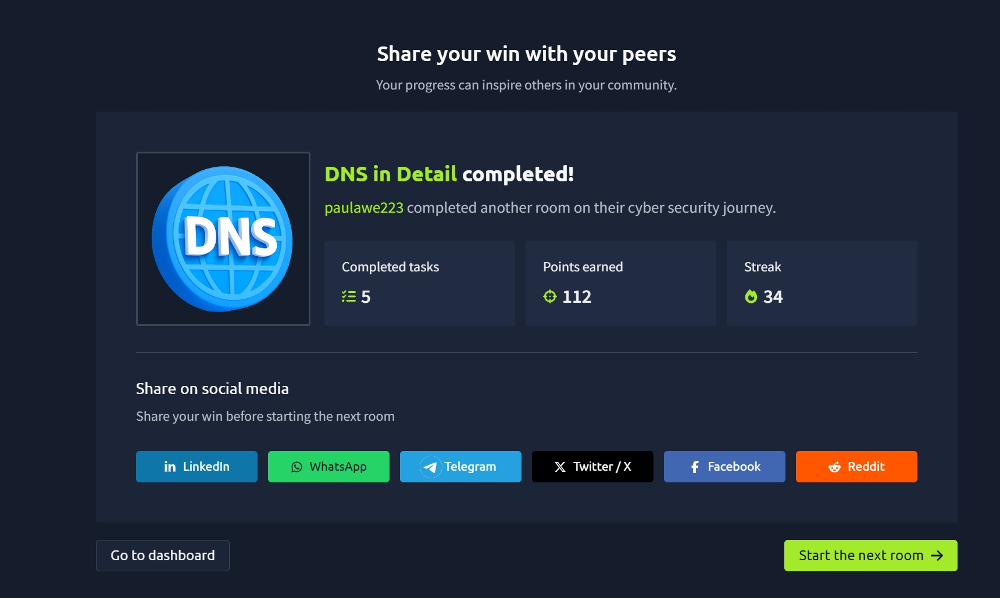

# TryHackMe: DNS in Detail

## Room Overview

The **DNS in Detail** room provided a deeper understanding of the Domain Name System (DNS), one of the core technologies that powers the internet. DNS acts like the internet's phonebook, translating human-readable domain names into IP addresses that computers can understand.

Throughout this room, I learned how domain names are structured, explored common DNS record types, and followed the complete process that occurs when a user requests a website.

---

## Tasks Completed

* Understanding the purpose of DNS
* Learning Domain Hierarchy
* Exploring Top-Level Domains (TLDs)
* Understanding Subdomains
* Learning Common DNS Record Types
* Understanding DNS Resolution
* Exploring Recursive and Authoritative DNS Servers

---

## Key Concepts Learned

### What is DNS?

DNS (Domain Name System) provides a simple way for users to communicate with devices on the internet without having to remember numerical IP addresses.

For example:

Instead of remembering:

```text
104.26.10.229
```

Users can simply remember:

```text
tryhackme.com
```

DNS translates domain names into IP addresses so that computers can locate the correct server.

---

## Domain Hierarchy

DNS follows a hierarchical structure.

Example:

```text
admin.tryhackme.com
```

This domain contains:

| Component | Description            |
| --------- | ---------------------- |
| .com      | Top-Level Domain (TLD) |
| tryhackme | Second-Level Domain    |
| admin     | Subdomain              |

---

### Top-Level Domain (TLD)

The TLD is the rightmost section of a domain name.

Examples:

```text
.com
.org
.edu
.gov
.net
```

There are two primary categories:

#### Generic Top-Level Domains (gTLD)

Used to indicate the purpose of a website.

Examples:

```text
.com
.org
.edu
.gov
```

#### Country Code Top-Level Domains (ccTLD)

Used to identify geographic locations.

Examples:

```text
.ca
.co.uk
.ng
.au
```

Modern DNS now includes many new TLDs such as:

```text
.online
.club
.website
.biz
```

---

### Second-Level Domain

The Second-Level Domain is the part directly before the TLD.

Example:

```text
tryhackme.com
```

Here:

```text
tryhackme
```

is the Second-Level Domain.

Requirements:

* Up to 63 characters
* Letters, numbers, and hyphens allowed
* Cannot begin or end with a hyphen

---

### Subdomains

Subdomains are located to the left of the Second-Level Domain.

Example:

```text
admin.tryhackme.com
```

In this case:

```text
admin
```

is the subdomain.

Additional examples:

```text
store.tryhackme.com
blog.tryhackme.com
jupiter.servers.tryhackme.com
```

Organizations often use subdomains to separate services and applications.

---

## DNS Record Types

DNS uses different record types for different purposes.

---

### A Record

Maps a domain name to an IPv4 address.

Example:

```text
104.26.10.229
```

Purpose:

* Directs traffic to web servers
* Most commonly used DNS record

---

### AAAA Record

Maps a domain name to an IPv6 address.

Example:

```text
2606:4700:20::681a:be5
```

Purpose:

* Supports modern IPv6 networking

---

### CNAME Record

Canonical Name (CNAME) records point one domain to another domain.

Example:

```text
store.tryhackme.com
```

might point to:

```text
shops.shopify.com
```

The DNS resolver then performs another lookup to obtain the IP address.

Purpose:

* Aliasing domains
* Hosting services on third-party platforms

---

### MX Record

Mail Exchange (MX) records specify which servers handle email for a domain.

Example:

```text
alt1.aspmx.l.google.com
```

Features:

* Supports mail routing
* Includes priority values
* Provides backup mail servers

Purpose:

* Email delivery and redundancy

---

### TXT Record

TXT records store text-based information.

Common uses include:

#### SPF Records

Used to specify which servers can send email for a domain.

Example:

```text
v=spf1 ip4:192.0.2.0/24 include:_spf.google.com ~all
```

#### Domain Verification

Used to prove ownership of a domain.

Example:

```text
MS=ms12345678
```

#### DMARC Records

Used to improve email security and reduce spoofing attacks.

TXT records play a significant role in modern email security.

---

## How DNS Resolution Works

When a user visits a website, several DNS servers work together to find the correct IP address.

---

### Step 1: Local Cache

The computer first checks its local DNS cache.

If the record exists, the process ends immediately.

Benefits:

* Faster browsing
* Reduced DNS traffic

---

### Step 2: Recursive DNS Server

If the record is not found locally, the request is sent to a Recursive DNS Server.

This server is usually provided by:

* ISP
* Google DNS
* Cloudflare DNS
* OpenDNS

The recursive server also checks its cache before continuing.

---

### Step 3: Root DNS Servers

If no cached result exists, the recursive server contacts a Root DNS Server.

The root server identifies the correct Top-Level Domain.

Example:

```text
www.tryhackme.com
```

The root server identifies:

```text
.com
```

and directs the query to the appropriate TLD server.

---

### Step 4: TLD Server

The TLD server identifies the authoritative nameserver responsible for the domain.

Example:

```text
tryhackme.com
```

might be managed by:

```text
kip.ns.cloudflare.com
uma.ns.cloudflare.com
```

The TLD server directs the request to the correct authoritative DNS server.

---

### Step 5: Authoritative DNS Server

The authoritative DNS server stores the official DNS records for the domain.

This server returns the requested record:

* A Record
* AAAA Record
* MX Record
* TXT Record
* CNAME Record

The result is then:

1. Returned to the recursive server
2. Cached locally
3. Sent back to the user's computer

---

### Time To Live (TTL)

Every DNS record contains a TTL (Time To Live) value.

TTL determines how long a DNS response can remain cached before it must be requested again.

Benefits:

* Faster DNS lookups
* Reduced network traffic
* Improved performance

---

## Why This Matters in Cybersecurity

DNS is one of the most critical services on the internet and is frequently targeted by attackers.

Cybersecurity professionals use DNS knowledge to:

* Investigate phishing attacks
* Analyze malicious domains
* Detect command-and-control traffic
* Monitor suspicious DNS activity
* Troubleshoot network issues
* Perform threat intelligence research

Understanding DNS is essential for penetration testing, blue team operations, SOC analysis, and network administration.

---

## Practical Skills Gained

* Understanding DNS architecture
* Identifying domain hierarchy
* Understanding TLDs and subdomains
* Learning common DNS record types
* Understanding DNS resolution
* Recognizing recursive and authoritative DNS servers
* Learning the role of DNS caching and TTL values

---

## Completion Screenshot



---

## Reflection

This room significantly improved my understanding of how DNS operates behind the scenes whenever a website is accessed. I learned how domain names are structured, how DNS records work, and how requests travel through recursive, root, TLD, and authoritative DNS servers before reaching their destination. Since DNS is heavily used in both network administration and cybersecurity investigations, this knowledge provides a strong foundation for analyzing network traffic, investigating malicious domains, and understanding how internet services function.

---

**Platform:** TryHackMe
**Room:** DNS in Detail
**Completed:** Day 22–23 of My Cybersecurity Learning Journey
