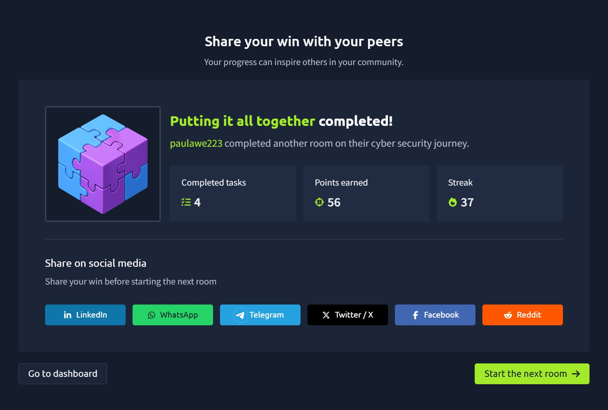

# TryHackMe: Putting It All Together

## Room Overview

The **Putting It All Together** room brought together many of the concepts learned throughout the previous networking and web fundamentals modules. I learned how websites operate as complete systems by combining DNS, HTTP, web servers, databases, load balancers, content delivery networks (CDNs), web application firewalls (WAFs), and backend technologies.

This room helped me understand the entire journey that occurs when a user requests a webpage, from typing a URL into a browser to receiving and displaying content.

---

## Tasks Completed

- Understanding the complete website request process
- Learning about Load Balancers
- Exploring Content Delivery Networks (CDNs)
- Understanding Databases
- Learning about Web Application Firewalls (WAFs)
- Understanding Web Servers
- Learning Virtual Hosts
- Understanding Static vs Dynamic Content
- Exploring Backend Languages

---

## How a Website Request Works

When a user visits a website, several technologies work together behind the scenes.

The process generally follows these steps:

### Step 1: DNS Lookup

The browser first needs to determine the IP address of the website.

Example:

```text
tryhackme.com
```

is converted into an IP address using DNS.

---

### Step 2: HTTP/HTTPS Communication

Once the IP address is known, the browser communicates with the web server using:

- HTTP
- HTTPS

The browser sends a request and waits for a response.

---

### Step 3: Web Server Response

The web server returns resources such as:

- HTML
- CSS
- JavaScript
- Images
- Videos

---

### Step 4: Browser Rendering

The browser processes the files and displays the webpage to the user.

This entire process happens in just a few seconds.

---

# Load Balancers

## What is a Load Balancer?

A load balancer sits in front of multiple servers and distributes incoming traffic between them.

Instead of sending all requests to a single server, the load balancer decides which server should handle each request.

---

## Why Load Balancers Are Important

Load balancers provide:

### Traffic Distribution

Traffic is spread across multiple servers.

Benefits include:

- Better performance
- Reduced server overload
- Improved scalability

---

### High Availability

If one server fails, traffic can be redirected to another healthy server.

This ensures websites remain available.

---

## Load Balancing Algorithms

### Round Robin

Requests are sent to servers in sequence.

Example:

```text
Request 1 → Server A
Request 2 → Server B
Request 3 → Server C
Request 4 → Server A
```

---

### Weighted Load Balancing

Traffic is distributed based on server capacity and workload.

The least busy server receives more requests.

---

## Health Checks

Load balancers regularly test servers.

If a server:

- Crashes
- Stops responding
- Returns errors

The load balancer temporarily removes it from service until it becomes healthy again.

---

# Content Delivery Networks (CDNs)

## What is a CDN?

A CDN (Content Delivery Network) stores copies of website content across servers located around the world.

Instead of every user connecting to a single server, they connect to the closest CDN location.

---

## Files Commonly Served by CDNs

Examples include:

- Images
- CSS files
- JavaScript files
- Videos
- Downloads

---

## Benefits of CDNs

### Faster Performance

Content is delivered from a nearby server.

### Reduced Server Load

Traffic is distributed across multiple locations.

### Improved User Experience

Users experience lower latency and faster page loading.

---

# Databases

## What is a Database?

A database stores information for websites and applications.

Examples of stored data include:

- User accounts
- Passwords
- Blog posts
- Products
- Orders
- Messages

Web servers communicate with databases to retrieve and store information.

---

## Common Database Technologies

Examples include:

- MySQL
- Microsoft SQL Server (MSSQL)
- PostgreSQL
- MongoDB

Each database platform has unique features and use cases.

---

## Why Databases Matter

Without databases, modern websites would not be able to:

- Store user information
- Remember login sessions
- Process transactions
- Display personalized content

---

# Web Application Firewalls (WAFs)

## What is a WAF?

A WAF (Web Application Firewall) sits between a user and a web server.

Its primary purpose is to protect web applications from attacks.

---

## How a WAF Works

The WAF analyzes incoming web requests before they reach the server.

It looks for:

- Malicious requests
- Known attack patterns
- Automated bots
- Excessive traffic

If a request appears dangerous, the WAF blocks it.

---

## Rate Limiting

One security feature provided by many WAFs is rate limiting.

Example:

A WAF may allow:

```text
100 requests per minute
```

from a single IP address.

Excess requests are blocked.

This helps prevent:

- Brute-force attacks
- Automated abuse
- Denial-of-Service (DoS) attacks

---

# Web Servers

## What is a Web Server?

A web server is software that listens for incoming requests and delivers website content.

Popular web servers include:

- Apache
- Nginx
- IIS
- NodeJS

---

## Web Server Root Directory

Web servers serve files from a specific folder called the root directory.

Examples:

### Linux

```text
/var/www/html
```

### Windows IIS

```text
C:\inetpub\wwwroot
```

If a user requests:

```text
http://example.com/picture.jpg
```

the web server retrieves the file from the root directory and sends it to the browser.

---

# Virtual Hosts

## What are Virtual Hosts?

Virtual Hosts allow multiple websites to run on the same web server.

The server examines the hostname requested by the browser and serves the correct website.

Example:

```text
one.com
two.com
```

can both exist on the same server.

---

## Benefits of Virtual Hosts

- Efficient resource usage
- Reduced hosting costs
- Easier management
- Support for multiple websites

There is effectively no limit to the number of websites a server can host.

---

# Static vs Dynamic Content

## Static Content

Static content never changes.

Examples:

- Images
- CSS files
- JavaScript files
- Fixed HTML pages

Static files are delivered directly to the browser.

---

## Dynamic Content

Dynamic content changes depending on user requests.

Examples:

- Search results
- User profiles
- Blog posts
- Shopping carts

Different users may receive different content.

---

## Frontend vs Backend

### Frontend

The frontend is everything visible to the user.

Examples:

- Layout
- Buttons
- Images
- Text

---

### Backend

The backend processes requests behind the scenes.

Examples:

- Database queries
- User authentication
- Business logic
- Data processing

Users cannot directly see backend code.

---

# Backend Languages

## What are Backend Languages?

Backend languages generate dynamic content and provide application functionality.

Examples include:

- PHP
- Python
- Ruby
- NodeJS
- Perl

---

## What Backend Languages Can Do

Backend languages can:

- Access databases
- Process user input
- Call external APIs
- Generate dynamic pages
- Perform authentication

These capabilities make modern web applications possible.

---

## Example of Dynamic Processing

A PHP application may receive:

```text
http://example.com/index.php?name=adam
```

The backend processes the request and returns:

```html
<html>
<body>Hello adam</body>
</html>
```

The user only sees the generated HTML, not the PHP code running behind the scenes.

---

# Why This Matters in Cybersecurity

Understanding how all web technologies work together is essential for cybersecurity professionals.

Security teams must understand:

- DNS
- HTTP/HTTPS
- Web Servers
- Databases
- WAFs
- CDNs
- Load Balancers
- Backend Applications

This knowledge helps identify:

- Misconfigurations
- Vulnerabilities
- Attack paths
- Security weaknesses

Many modern cyberattacks target web applications and their supporting infrastructure.

---

## Practical Skills Gained

- Understanding the complete website request lifecycle
- Learning how load balancers distribute traffic
- Understanding CDN functionality
- Learning database fundamentals
- Understanding WAF protection mechanisms
- Learning web server architecture
- Understanding virtual hosts
- Differentiating static and dynamic content
- Understanding frontend and backend technologies

---

## Completion Screenshot



---

## Reflection

This room helped connect many of the concepts I learned in previous networking and web fundamentals rooms. I now have a much clearer understanding of how websites operate as complete systems involving DNS, HTTP, load balancers, databases, CDNs, WAFs, web servers, and backend applications. Understanding how these technologies interact provides a strong foundation for future cybersecurity topics such as web application security, penetration testing, threat analysis, and security architecture.

---

**Platform:** TryHackMe  
**Room:** Putting It All Together  
**Completed:** Day 28–29 of My Cybersecurity Learning Journey
