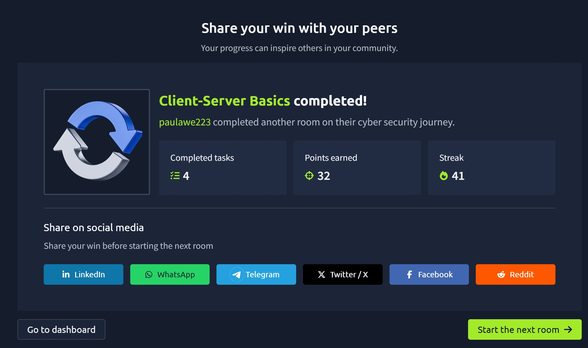

# TryHackMe Day 30–31: Client-Server Basics

## Room Information

- **Room Name:** Client-Server Basics
- **Platform:** TryHackMe
- **Status:** Completed ✅
- **Day:** 30–31
- **Difficulty:** Beginner
- **Topics Covered:** Client-Server Model, DNS, Protocols, Ports, HTTP, Requests and Responses

---

## Overview

In this room, I learned how computers communicate using the Client-Server model. The room explained how services are provided across networks and introduced key networking concepts such as clients, servers, DNS, ports, protocols, and HTTP communication.

One of the most useful parts of this room was understanding how web browsers communicate with web servers and how requests and responses are exchanged across a network.

---

## Key Concepts Learned

### 1. Client-Server Model

The Client-Server model is one of the foundations of modern networking.

- A **Client** is a device or application that requests a service.
- A **Server** is a system that provides the requested service.
- The client always initiates the communication.

#### Example

When I visit a website:

1. My browser acts as the client.
2. The web server hosts the website.
3. The browser sends a request.
4. The server sends back a response.

---

### 2. Requests and Responses

Communication between clients and servers follows a request-response process.

#### Request

A client asks a server for a resource or service.

Example:

```http
GET /index.html
```

#### Response

The server returns:

- A status code
- Headers
- Requested content

Example:

```http
HTTP/1.1 200 OK
```

The response may contain:

- Web pages
- Images
- Files
- Error messages

---

### 3. Protocols

A protocol is a set of rules that allows systems to communicate.

Protocols define:

- Communication format
- Commands available
- Message structure
- Error handling

Examples include:

- HTTP
- HTTPS
- FTP
- DNS
- SSH

Without protocols, computers would not understand each other.

---

### 4. Ports

Ports identify specific services running on a system.

A server can provide multiple services simultaneously by listening on different ports.

Common ports:

| Service | Port |
|----------|--------|
| HTTP | 80 |
| HTTPS | 443 |
| DNS | 53 |
| SSH | 22 |
| FTP | 21 |

Ports help direct traffic to the correct service.

---

### 5. DNS (Domain Name System)

DNS translates human-readable domain names into IP addresses.

Example:

```text
tryhackme.com
```

might resolve to:

```text
104.x.x.x
```

Instead of remembering IP addresses, users simply type domain names and DNS performs the translation.

DNS acts like the internet's phonebook.

---

### 6. HTTP and HTTPS

HTTP stands for:

**HyperText Transfer Protocol**

HTTPS stands for:

**HyperText Transfer Protocol Secure**

HTTPS encrypts communication between client and server, providing:

- Confidentiality
- Integrity
- Authentication

Most modern websites use HTTPS.

---

## HTTP Methods Learned

### GET

Used to retrieve information from a server.

Example:

```http
GET /index.html
```

Purpose:

- View web pages
- Retrieve data
- Download resources

---

### Other HTTP Methods

I also learned about several important HTTP methods:

| Method | Purpose |
|----------|----------|
| GET | Retrieve data |
| POST | Submit new data |
| PUT | Update data |
| PATCH | Partially update data |
| DELETE | Remove data |
| HEAD | Retrieve headers only |
| OPTIONS | Show supported methods |
| CONNECT | Establish a tunnel |
| TRACE | Diagnostic testing |

---

## Understanding HTTP Communication

A typical HTTP interaction looks like this:

### Step 1: Client Request

```http
GET /index.html HTTP/1.1
Host: example.com
```

### Step 2: Server Processing

The server receives the request and locates the resource.

### Step 3: Server Response

```http
HTTP/1.1 200 OK
```

The requested webpage is returned to the client.

---

## Status Codes Learned

Common HTTP status codes include:

| Code | Meaning |
|--------|----------|
| 200 | Success |
| 301 | Redirect |
| 403 | Forbidden |
| 404 | Not Found |
| 500 | Internal Server Error |

The room demonstrated a successful response using:

```http
200 OK
```

---

## Browser Developer Tools

The room introduced Firefox Developer Tools.

Using the Network tab, I learned how to:

- View HTTP requests
- Inspect responses
- Analyze network traffic
- Identify status codes
- View headers
- Examine webpage resources

This is a valuable skill for both networking and cybersecurity investigations.

---

## Practical Example

When visiting a website:

1. The browser requests the webpage.
2. DNS resolves the domain name.
3. The client connects to the server.
4. Communication occurs using HTTP or HTTPS.
5. The server sends the requested content.
6. The browser displays the webpage.

This process happens in seconds but involves multiple networking components working together.

---

## Key Takeaways

- Clients request services from servers.
- Servers provide resources and responses.
- Protocols define communication rules.
- Ports identify specific services.
- DNS converts domain names into IP addresses.
- HTTP and HTTPS power web communication.
- Developer tools help analyze network traffic.
- Understanding client-server communication is essential for cybersecurity.

---

## Skills Gained

- Understanding the Client-Server model
- Identifying the roles of clients and servers
- Understanding DNS resolution
- Recognizing common network ports
- Understanding HTTP communication
- Interpreting HTTP status codes
- Using browser developer tools
- Analyzing web requests and responses

---

## Completion Proof

Completed the **Client-Server Basics** room on TryHackMe.



---

## Reflection

This room helped me understand the fundamental communication model that powers the internet. Learning how clients, servers, DNS, ports, and HTTP work together provided a strong foundation for future topics such as web security, network analysis, penetration testing, and cybersecurity investigations.

Understanding these concepts is essential before moving into more advanced networking and security topics.
