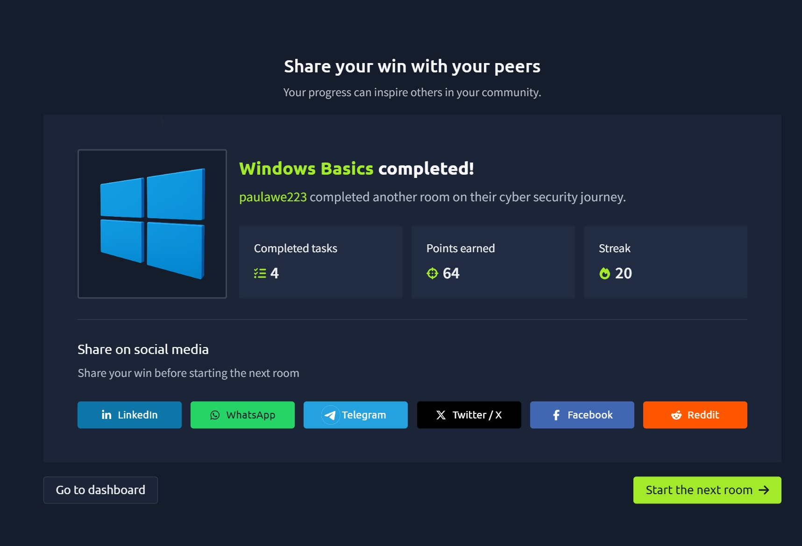

# TryHackMe Day 38–39: Windows Basics

## Room Information

- **Room Name:** Windows Basics
- **Platform:** TryHackMe
- **Status:** Completed ✅
- **Day:** 38–39
- **Difficulty:** Beginner
- **Topics Covered:** Windows Interface, Authentication, File Explorer, Windows Settings, Task Manager, Windows Security, Windows Defender Firewall

---

## Completion Badge



---

## Overview

In this room, I explored the fundamentals of the Microsoft Windows operating system and learned how to navigate its graphical interface, manage files, configure settings, install applications, and use built-in security tools.

Windows is the world's most widely used desktop operating system and serves as a foundation for many cybersecurity environments. Understanding how Windows works is essential for system administration, security analysis, and incident response.

---

# What is Windows?

Microsoft Windows is a graphical operating system that allows users to interact with computer hardware and software through an intuitive interface.

Windows evolved from:

- MS-DOS (command-line operating system)
- Windows 1.0 (released in 1985)
- Modern Windows versions such as Windows 10 and Windows 11

Today, Windows provides:

- Graphical User Interface (GUI)
- File Management
- Application Management
- Security Controls
- Networking Capabilities

---

# Learning Objectives

During this room I learned how to:

- Navigate the Windows desktop environment
- Use the Start Menu and Taskbar
- Browse files using File Explorer
- View system information
- Install and uninstall applications
- Configure Windows settings
- Monitor system performance
- Use Windows security tools

---

# Logging In and Authentication

Before accessing Windows, users must authenticate themselves.

Common authentication methods include:

- Passwords
- PINs
- Biometrics

Windows uses different account types.

---

## Guest Account

Permissions:

- Very limited access
- Temporary usage
- Cannot modify important settings

Best used for:

- Temporary users
- Public computers

---

## Standard Account

Permissions:

- Daily computing tasks
- Running applications
- Changing personal settings

Restrictions:

- Cannot make major system changes

---

## Administrator Account

Permissions:

- Full system access
- Install software
- Modify configurations
- Manage users

This account type has the highest privilege level.

---

# The Windows Desktop

The Desktop is the primary workspace users see after logging in.

It contains:

- Files
- Folders
- Shortcuts
- Applications

The Desktop serves as the central area for interacting with Windows.

---

# Components of the Windows Desktop

## 1. Desktop Icons

Desktop icons provide quick access to:

- Applications
- Files
- Folders
- Recycle Bin

Users can customize these shortcuts.

---

## 2. Start Menu

The Start Menu is the primary navigation hub.

Functions include:

- Launching applications
- Accessing settings
- Searching files
- Power options

The Start Menu is one of the most important Windows features.

---

## 3. Search

Windows Search helps locate:

- Files
- Applications
- Settings
- Documents

Searching is often faster than manually browsing folders.

---

## 4. Task View

Task View allows users to:

- View open applications
- Switch between windows
- Improve multitasking

---

## 5. Pinned Applications

Frequently used applications can be pinned to the taskbar for quick access.

Examples:

- File Explorer
- Browser
- Terminal

---

## 6. Network and Audio Controls

Provides quick access to:

- Wi-Fi settings
- Network information
- Volume controls
- Sound devices

---

## 7. Date and Time

Displays:

- Current date
- Current time
- Calendar access

Users can also configure regional settings here.

---

## 8. Notifications

Displays:

- Security alerts
- System notifications
- Application messages

Provides access to important system information.

---

# Understanding the Start Menu

The Start Menu acts as a central access point for Windows.

From the Start Menu users can:

- Launch applications
- Access settings
- Search for files
- Restart the computer
- Shut down the system
- Sign out

Think of it as the command center of Windows.

---

# Built-In Windows Tools

Windows comes with many useful built-in applications.

Examples include:

- Notepad
- File Explorer
- Task Manager
- Windows Security
- Settings

These tools help users perform everyday tasks without installing additional software.

---

# Viewing System Information

Windows provides an "About Your PC" section that displays:

- Device specifications
- Operating system version
- Hardware information
- Security information

This information is useful when:

- Troubleshooting
- Upgrading hardware
- Verifying system details

---

# File Exploration and Management

Windows organizes files using a hierarchical folder structure.

Examples:

```text
C:
└── Users
    └── Administrator
        └── Desktop
```

Folders can contain:

- Files
- Subfolders
- Applications

This structure helps keep information organized.

---

# File Explorer

File Explorer is the primary tool used to:

- Browse files
- Create folders
- Move files
- Rename files
- Delete files

Important features include:

- Navigation pane
- Address bar
- Search bar
- File preview

---

## Understanding File Paths

A file path identifies a file's location.

Example:

```text
C:\Users\Administrator\Desktop\TryHatMe Onboarding
```

Knowing how to read file paths is an essential Windows skill.

---

# Application Management

Applications are programs installed on Windows.

Examples:

- Browsers
- Office Software
- Media Players
- Security Tools

Windows allows users to:

- Install applications
- Update applications
- Remove applications

---

# Updating Applications

Keeping software updated is critical.

Benefits include:

- Security patches
- Bug fixes
- Performance improvements
- New features

---

## Windows Update

Windows Update helps maintain:

- Operating system updates
- Security patches
- Driver updates

Regular updates improve system security and stability.

---

# Installing Applications

Applications can be installed from:

## Microsoft Store

Advantages:

- Trusted source
- Easy installation
- Automatic updates

---

## Vendor Websites

Applications are commonly distributed as:

```text
.exe
.msi
```

Users should only download software from trusted sources.

---

# Uninstalling Applications

Applications can be removed using:

- Microsoft Store
- Settings
- Control Panel
- Built-in uninstallers

Removing unused software helps maintain system performance.

---

# Windows Settings

The Windows Settings application provides centralized system management.

Settings categories include:

- System
- Devices
- Network
- Personalization
- Accounts
- Privacy
- Security

Most modern configuration changes happen here.

---

# Control Panel

Control Panel is the legacy Windows administration interface.

It provides access to:

- Hardware settings
- User accounts
- Programs
- Networking options

Many advanced administrative tools remain accessible through Control Panel.

---

# Task Manager

Task Manager is one of the most important Windows troubleshooting tools.

It allows users to monitor:

- Running applications
- Background processes
- Resource usage
- Performance statistics

---

## Processes Tab

Displays:

- Running applications
- Background services
- CPU usage
- Memory usage

Useful for identifying resource-heavy applications.

---

## Performance Tab

Displays:

- CPU utilization
- Memory usage
- Disk activity
- Network activity

Provides real-time performance monitoring.

---

## Users Tab

Shows:

- Logged-in users
- Resource usage by user

Useful on multi-user systems.

---

## Details Tab

Displays advanced process information including:

- Process names
- Process IDs (PIDs)
- System processes

Frequently used during security investigations.

---

## Services Tab

Shows:

- Running services
- Stopped services
- Service status

Useful when troubleshooting Windows functionality.

---

# Windows Security

Windows includes built-in security tools designed to protect users and systems.

Windows Security serves as the central security dashboard.

---

## Virus & Threat Protection

Protects against:

- Malware
- Viruses
- Trojans
- Other malicious software

Features include:

- Real-time protection
- Manual scans
- Threat detection

---

## Firewall & Network Protection

Monitors:

- Incoming traffic
- Outgoing traffic
- Network access attempts

Helps block unauthorized access.

---

## App & Browser Control

Protects users from:

- Unsafe websites
- Malicious downloads
- Suspicious applications

---

## Device Security

Provides hardware-level security protections.

Examples include:

- Secure Boot
- Hardware security features

---

# Windows Defender Firewall

Windows Defender Firewall protects systems from unauthorized network activity.

Functions include:

- Monitoring connections
- Blocking suspicious traffic
- Enforcing security rules

---

## Firewall Profiles

### Domain

Used within organizational environments.

Examples:

- Businesses
- Schools
- Government networks

---

### Private

Used on trusted networks.

Examples:

- Home networks
- Personal labs

---

### Public

Used on untrusted networks.

Examples:

- Airports
- Coffee shops
- Public Wi-Fi

This profile typically applies stricter security controls.

---

# Key Terminology

## Desktop

The primary workspace of Windows.

---

## Taskbar

A control strip providing quick access to applications and notifications.

---

## Start Menu

The central location for launching programs and accessing settings.

---

## Search

A built-in feature for finding files, folders, and applications.

---

## File Explorer

The primary Windows file management tool.

---

## Windows Update

The built-in operating system update service.

---

## Microsoft Store

Windows application marketplace.

---

## Windows Settings

Centralized configuration interface.

---

## Control Panel

Legacy administration interface.

---

## Task Manager

Real-time monitoring and troubleshooting tool.

---

## Windows Security

The main dashboard for managing built-in Windows security features.

---

## Windows Defender Firewall

Built-in firewall protecting against unauthorized network access.

---

# Key Takeaways

- Windows is the world's most popular desktop operating system.
- Authentication determines user permissions.
- The Desktop and Taskbar are the primary workspace components.
- The Start Menu serves as the main navigation hub.
- File Explorer is used to manage files and folders.
- Windows Settings and Control Panel provide configuration options.
- Task Manager helps monitor processes and performance.
- Windows Security provides built-in protection.
- Windows Defender Firewall controls network traffic and system access.

---

# Skills Gained

- Navigating the Windows interface
- Managing files and folders
- Understanding file paths
- Installing and updating applications
- Using Task Manager
- Monitoring system performance
- Configuring Windows settings
- Understanding Windows security features
- Working with Windows Defender Firewall

---

## Reflection

This room provided a solid introduction to the Windows operating system and the tools used every day by both regular users and cybersecurity professionals. I learned how Windows organizes files, manages applications, monitors performance, and protects systems using built-in security features. These foundational skills will be important as I continue learning Windows administration, security monitoring, and cybersecurity operations.

---

**Platform:** TryHackMe  
**Room:** Windows Basics  
**Completed:** Day 38–39 of My Cybersecurity Learning Journey
