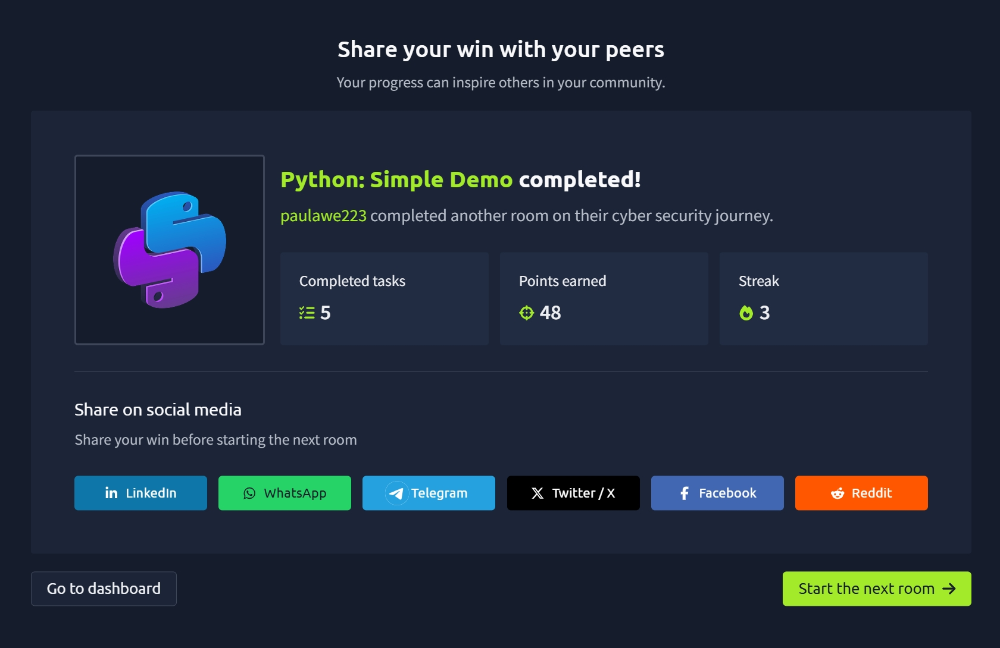

# TryHackMe Day 50–51: Python Simple Demo

## Overview

In this room, I was introduced to the Python programming language through a practical hands-on project. Python is one of the most popular programming languages used in cybersecurity, automation, scripting, data analysis, machine learning, and web development.

The room used a simple "Guess the Number" game to demonstrate fundamental programming concepts and how a complete Python program is structured.

Through this exercise, I learned how programs store information, make decisions, accept user input, and repeat actions using loops.

---

## Learning Objectives

The room focused on three primary goals:

- Learn about Python variables
- Understand conditional statements
- See loops and iteration in action

These concepts form the foundation of programming and are essential for future cybersecurity scripting and automation tasks. :contentReference[oaicite:1]{index=1}

---

## What is Python?

Python is a high-level, general-purpose programming language.

### High-Level Language

A high-level language hides most of the complex implementation details from the programmer, making code easier to read and write.

### General-Purpose Language

Python can be used for:

- Automation scripts
- Cybersecurity tools
- Web applications
- Data science
- Machine learning
- Network administration
- System management

Its simplicity and readability make it one of the most beginner-friendly programming languages available. :contentReference[oaicite:2]{index=2}

---

## Building a Guess the Number Game

The room walked through creating a simple game where:

1. The computer secretly chooses a number between 1 and 20.
2. The player guesses the number.
3. The program provides hints.
4. The game continues until the correct number is found.

Example:

```text
I'm thinking of a number between 1 and 20

Take a guess: 10
Too high, try again.

Take a guess: 5
Too low, try again.

Take a guess: 8
You got it in 3 tries!
```

This simple project demonstrates several important programming concepts working together.

---

## Variables

Variables are used to store data while a program runs.

The game uses three variables:

```python
secret
guess
tries
```

### secret

Stores the randomly generated number.

```python
secret = random.randint(1,20)
```

### guess

Stores the user's current guess.

```python
guess = int(text)
```

### tries

Tracks the number of attempts made by the player.

```python
tries = tries + 1
```

Variables allow programs to remember information and update values during execution. :contentReference[oaicite:3]{index=3}

---

## Random Number Generation

The room introduced Python's random module.

```python
import random
```

A random number is generated using:

```python
secret = random.randint(1,20)
```

This selects a number between 1 and 20 inclusive.

Randomness is commonly used in:

- Games
- Security tools
- Simulations
- Password generation
- Cryptography concepts

---

## User Input

Programs often need information from users.

Python uses:

```python
input()
```

Example:

```python
text = input("Take a guess: ")
```

Since input is received as text, it must be converted into a number.

```python
guess = int(text)
```

This allows the program to compare the user's input with the secret number.

---

## Conditional Statements

Conditional statements allow programs to make decisions.

Python uses:

```python
if
elif
else
```

Example:

```python
if guess < secret:
    print("Too low")
elif guess > secret:
    print("Too high")
else:
    print("You got it!")
```

The room demonstrated how a program evaluates different possibilities and performs actions depending on the outcome. :contentReference[oaicite:4]{index=4}

---

## Comparison Operators

Several comparison operators were introduced:

| Operator | Meaning |
|-----------|---------|
| < | Less than |
| > | Greater than |
| == | Equal to |
| != | Not equal to |

Examples:

```python
guess < secret
guess > secret
guess != secret
```

These operators are essential for decision-making within programs.

---

## Input Validation

The game checks whether a number is outside the allowed range.

```python
if guess < 1 or guess > 20:
    print("That number is out of range.")
```

This helps prevent invalid input from affecting the game.

Input validation is an important concept in software development and cybersecurity because it helps reduce errors and security risks.

---

## Loops and Iteration

The room introduced loops using:

```python
while
```

The loop continues until the player correctly guesses the secret number.

```python
while guess != secret:
```

This means:

"Keep repeating the code while the guess is not equal to the secret number."

Loops allow programs to repeat actions automatically instead of requiring duplicated code. :contentReference[oaicite:5]{index=5}

---

## The Complete Game Logic

The final program combines:

- Variables
- Random numbers
- User input
- Conditional statements
- Loops

Workflow:

1. Generate a secret number.
2. Ask the user for a guess.
3. Compare the guess.
4. Display a hint.
5. Repeat until correct.
6. Display the number of attempts.

This demonstrates how simple programming building blocks work together to create a functioning application.

---

## Key Takeaways

Through this room, I learned:

- Python is a beginner-friendly programming language.
- Variables store information while programs run.
- User input can be collected and processed.
- Conditional statements help programs make decisions.
- Loops allow code to repeat automatically.
- Programs often combine multiple concepts to solve a problem.
- Basic scripting skills are valuable in cybersecurity and automation.

---

## Skills Gained

- Python Fundamentals
- Variables and Data Storage
- User Input Handling
- Conditional Logic
- Comparison Operators
- Input Validation
- While Loops
- Iteration
- Basic Program Design
- Problem Solving with Code

---

## Why This Matters for Cybersecurity

Python is one of the most widely used languages in cybersecurity.

Many security professionals use Python for:

- Automating repetitive tasks
- Log analysis
- Network scanning
- Security monitoring
- Threat detection
- Tool development
- Incident response

Learning Python fundamentals provides a strong foundation for future cybersecurity scripting and automation projects.

---

## Completion Badge



Successfully completed the **Python: Simple Demo** room on TryHackMe as part of my cybersecurity learning journey.
