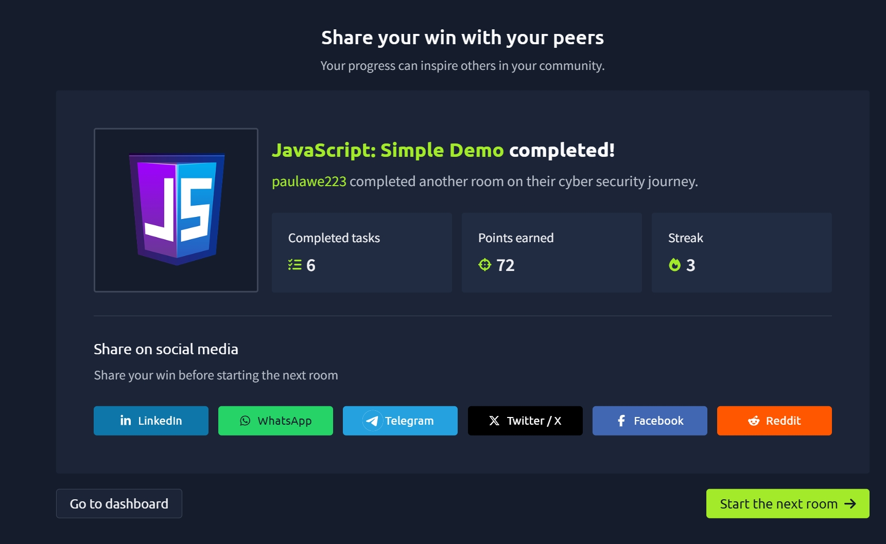

# TryHackMe Day 52–53: JavaScript Simple Demo

## Overview

In this room, I was introduced to JavaScript, one of the most widely used programming languages in the world. JavaScript powers the majority of modern websites and can be used on both the client side (web browsers) and server side through Node.js.

To demonstrate core programming concepts, the room guided me through building a simple "Guess the Number" game where the user attempts to guess a randomly generated number between 1 and 20.

This room helped me understand how JavaScript programs store information, receive user input, make decisions, and repeat actions using loops.

---

## Learning Objectives

The room focused on the following objectives:

- Learn about JavaScript variables
- Understand conditional statements
- See iteration (loops) in action

These concepts form the foundation of JavaScript programming and are essential for web development, automation, and cybersecurity scripting. :contentReference[oaicite:1]{index=1}

---

## What is JavaScript?

JavaScript is one of the most popular programming languages used today.

Originally, JavaScript was designed to run inside web browsers and make websites interactive. Today, with technologies like Node.js, JavaScript can also be used to build server-side applications.

Common uses include:

- Interactive websites
- Web applications
- Automation
- APIs
- Backend development
- Security tools
- Real-time applications

---

## The Guess the Number Game

The room used a simple game to demonstrate JavaScript fundamentals.

Game workflow:

1. The computer chooses a random number between 1 and 20.
2. The user enters a guess.
3. The program tells the user if the guess is too low or too high.
4. The process repeats until the correct number is guessed.

Example:

```text
I'm thinking of a number between 1 and 20

Take a guess: 10
Too high, try again.

Take a guess: 5
Too low, try again.

Take a guess: 7
You got it in 3 tries!
```

This project demonstrates how multiple programming concepts work together to create a functional application.

---

## Running JavaScript with Node.js

The room introduced Node.js as the easiest way to run JavaScript programs from the command line.

Example:

```bash
node guess_v3.js
```

Node.js allows JavaScript code to run outside a web browser, making it useful for scripting, automation, and backend development. :contentReference[oaicite:2]{index=2}

---

## Variables

Variables are used to store information that can change while a program runs.

JavaScript uses the `let` keyword to create variables.

Example:

```javascript
let tries = 0;
let guess = 0;
```

### tries

Tracks the number of attempts made by the user.

### guess

Stores the user's current guess.

Variables help programs remember and update information during execution.

---

## Constants

JavaScript uses the `const` keyword for values that should not change.

Example:

```javascript
const secret = 12;
```

In the game, the secret number remains unchanged after it is generated.

```javascript
const secret = Math.floor(Math.random() * 20) + 1;
```

This creates a random number between 1 and 20.

---

## Random Number Generation

The room introduced:

```javascript
Math.random()
```

and

```javascript
Math.floor()
```

Example:

```javascript
const secret = Math.floor(Math.random() * 20) + 1;
```

How it works:

1. `Math.random()` generates a decimal between 0 and 1.
2. Multiplying by 20 creates a range between 0 and 20.
3. `Math.floor()` removes the decimal portion.
4. Adding 1 shifts the range to 1–20.

This becomes the secret number the user must guess. :contentReference[oaicite:3]{index=3}

---

## Displaying Output

JavaScript displays information using:

```javascript
console.log()
```

Example:

```javascript
console.log("I'm thinking of a number between 1 and 20");
```

This sends text to the terminal or console.

---

## Receiving User Input

The room introduced the Node.js readline module.

Example:

```javascript
const text = await rl.question("Take a guess: ");
```

User input is initially received as text.

To convert it into a number:

```javascript
guess = parseInt(text, 10);
```

This allows the program to perform numerical comparisons.

---

## Understanding Readline

To collect user input, several modules were imported:

```javascript
import * as readline from "node:readline/promises";
import { stdin as input, stdout as output } from "node:process";
```

Then the interface was created:

```javascript
const rl = readline.createInterface({ input, output });
```

This allows JavaScript programs running in Node.js to interact with users through the command line.

---

## Conditional Statements

Conditional statements help programs make decisions.

JavaScript uses:

```javascript
if
else if
else
```

Example:

```javascript
if (guess < secret) {
    console.log("Too low");
}
else if (guess > secret) {
    console.log("Too high");
}
else {
    console.log("You got it!");
}
```

The program evaluates conditions and responds appropriately based on the user's input. :contentReference[oaicite:4]{index=4}

---

## Logical Operators

The room introduced:

```javascript
||
```

which means OR.

Example:

```javascript
if (guess < 1 || guess > 20)
```

This checks whether the user's input falls outside the allowed range.

---

## Input Validation

The game validates user input before comparing it to the secret number.

Example:

```javascript
if (guess < 1 || guess > 20) {
    console.log("That number is out of range. Try again.");
}
```

Input validation is important because it helps programs handle unexpected or invalid data safely.

---

## Loops and Iteration

The room introduced the `while` loop.

Example:

```javascript
while (guess !== secret)
```

This means:

"Continue running as long as the guess is not equal to the secret number."

The loop repeatedly:

- Prompts the user
- Accepts input
- Converts input to a number
- Checks the guess
- Displays feedback

until the correct answer is found. :contentReference[oaicite:5]{index=5}

---

## Comparison Operators

Several comparison operators were used:

| Operator | Meaning |
|-----------|---------|
| < | Less than |
| > | Greater than |
| === | Equal to |
| !== | Not equal to |

These operators allow the program to compare values and make decisions.

---

## Program Workflow

The completed program performs the following steps:

1. Generate a random secret number.
2. Display a message to the user.
3. Ask for a guess.
4. Convert the input into a number.
5. Compare the guess with the secret.
6. Provide feedback.
7. Repeat until the correct number is found.
8. Display the number of attempts used.

This demonstrates how multiple programming concepts combine to create a fully functional application.

---

## Key Takeaways

Through this room, I learned:

- JavaScript powers modern websites and applications.
- Variables store information that changes.
- Constants store values that remain fixed.
- User input can be collected using Node.js.
- Conditional statements allow programs to make decisions.
- Loops repeat actions until a condition is met.
- Input validation improves program reliability.
- JavaScript can be used beyond web browsers through Node.js.

---

## Skills Gained

- JavaScript Fundamentals
- Variables and Constants
- Random Number Generation
- User Input Handling
- Conditional Logic
- Logical Operators
- Input Validation
- While Loops
- Iteration
- Basic Program Design
- Node.js Fundamentals

---

## Why This Matters for Cybersecurity

JavaScript is commonly encountered during security assessments because it powers a large portion of modern websites and web applications.

Understanding JavaScript helps with:

- Web application security
- Cross-Site Scripting (XSS) analysis
- Browser-based attacks
- Secure coding practices
- Security testing
- Web application development

Learning JavaScript fundamentals provides an important foundation for future web security studies.

---

## Completion Badge



Successfully completed the **JavaScript: Simple Demo** room on TryHackMe as part of my cybersecurity learning journey.

---
