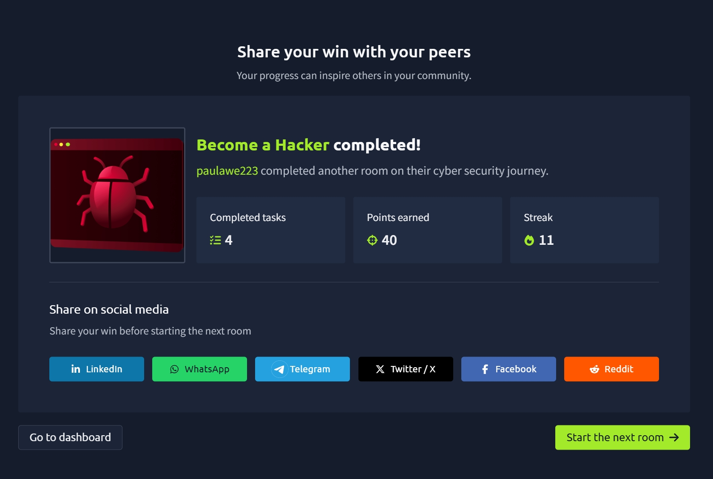

# TryHackMe Day 60–61: Become a Hacker

## 🧠 What I Learned

In this room, I was introduced to the mindset of an ethical hacker and learned how offensive security professionals identify weaknesses before malicious attackers can exploit them. Instead of simply using systems as intended, I learned to think from an attacker's perspective by questioning how applications can be abused or misconfigured.

I also completed my first hands-on ethical hacking exercise by discovering hidden web pages, identifying login functionality, and using security tools to automate common penetration testing tasks.

---

## What is Offensive Security?

Offensive Security focuses on finding and exploiting security weaknesses in a controlled and authorized manner.

Unlike malicious hackers, ethical hackers perform these activities with permission to help organizations strengthen their security before attackers find vulnerabilities.

The goal is to:

- Identify weaknesses
- Demonstrate real-world risks
- Help organizations improve their defenses

---

## Important Offensive Security Terms

During this room I learned several important cybersecurity terms.

### Red Teaming

A simulated attack designed to test an organization's security controls by acting like a real attacker.

### Penetration Testing

An authorized security assessment where vulnerabilities are identified and safely exploited within an approved scope.

### Vulnerability

A weakness in a system that could allow unauthorized access or compromise.

### Exploit

A technique used to take advantage of a vulnerability.

### Scope

The boundaries that define what systems and activities are authorized during a security assessment.

One of the biggest lessons from this room is that ethical hacking always requires permission.

---

## Finding Hidden Web Pages

The first practical exercise involved discovering hidden pages on a web application.

I manually tested several URLs, including:

- /sitemap
- /mail
- /register
- /login
- /admin

By checking for valid pages instead of assuming only visible pages existed, I learned how attackers enumerate websites to discover hidden functionality.

---

## Using Gobuster

I was introduced to **Gobuster**, a directory enumeration tool used by penetration testers.

Example command:

```bash
gobuster dir --url http://www.onlineshop.thm/ -w /usr/share/wordlists/dirbuster/directory-list.txt
```

Gobuster automatically checks hundreds or thousands of possible directories instead of manually testing each one.

This makes reconnaissance much faster and more efficient.

---

## Chaining Weaknesses

One important concept I learned is that small weaknesses can become dangerous when combined.

For example:

- Hidden login page
- Weak password
- Administrative account

Each issue may seem minor individually, but together they can allow complete system compromise.

This "domino effect" is something ethical hackers actively look for during assessments.

---

## Thinking Like a Hacker

This room emphasized developing the hacker mindset.

Instead of asking:

> Does this feature work?

I learned to ask:

- What if it doesn't?
- What if someone abuses it?
- What assumptions did the developer make?
- Can multiple weaknesses be combined?

Thinking creatively is an essential skill for penetration testing.

---

## Discovering Valid Credentials

The next exercise focused on authentication.

Using the username:

```
admin
```

I tested several common passwords to identify valid login credentials.

This demonstrated how weak passwords can expose sensitive administrative functionality.

Once authenticated, attackers may gain access to:

- Sensitive data
- Administrative features
- User information
- Additional attack opportunities

---

## Using Hydra

I also learned about **Hydra**, a password-testing tool used to automate login attempts.

Example command:

```bash
hydra -l admin -P passlist.txt www.onlineshop.thm http-post-form "/login:username=^USER^&password=^PASS^:F=incorrect" -V
```

Hydra performs a dictionary attack by automatically testing passwords from a wordlist until it finds valid credentials.

This demonstrated why strong passwords are critical for protecting applications.

---

## Key Terminology I Learned

- Scope
- Vulnerability
- Exploit
- Enumeration
- Credentials
- Authentication
- Dictionary Attack

These are foundational concepts that appear throughout penetration testing and ethical hacking.

---

## Career Paths

This room also introduced several offensive security career options:

- Penetration Tester
- Ethical Hacker
- Red Team Operator
- Vulnerability Researcher

It also recommended continuing with:

- Cyber Security 101
- Jr Penetration Tester
- Become a Defender
- SOC Level 1

---

## Key Takeaways

From this room I learned that:

- Ethical hacking always requires authorization.
- Offensive security focuses on finding weaknesses before attackers do.
- Enumeration is one of the first stages of penetration testing.
- Gobuster automates directory discovery.
- Hydra automates password testing using dictionary attacks.
- Small vulnerabilities can be chained together to create major security risks.
- Thinking like an attacker helps security professionals better defend systems.

This room was a great introduction to offensive security and gave me my first experience using real penetration testing tools in a safe, controlled environment.

---

## 📸 Proof of Completion


